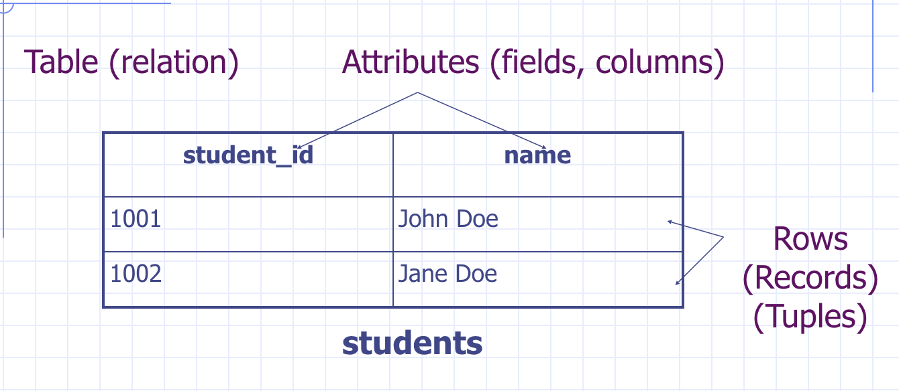
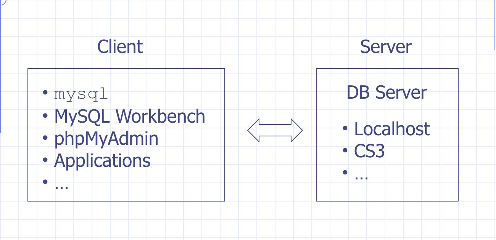
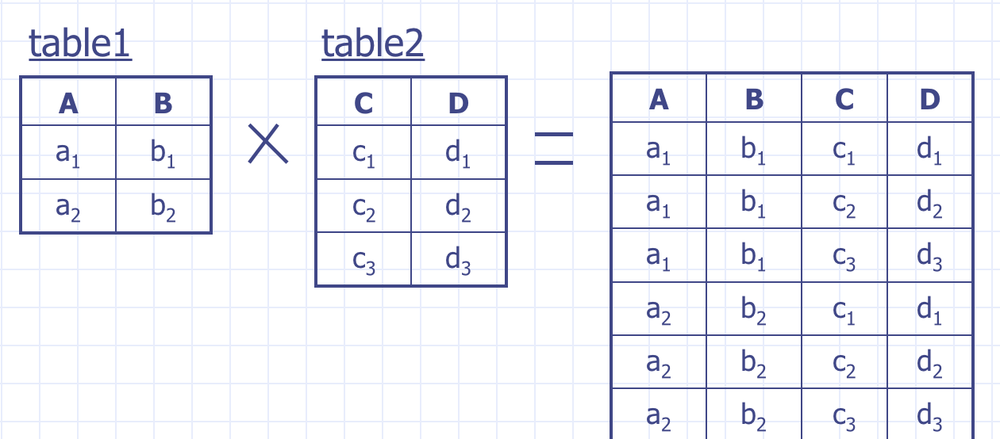
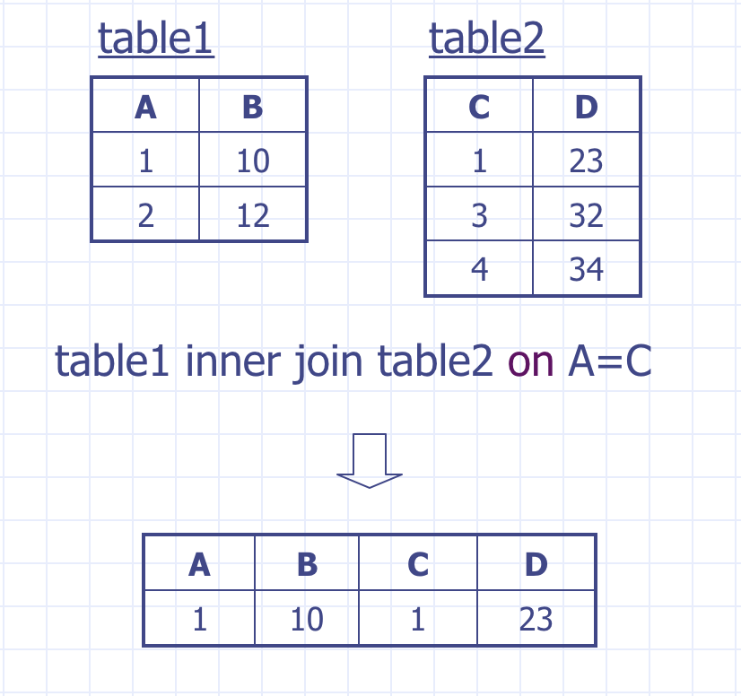
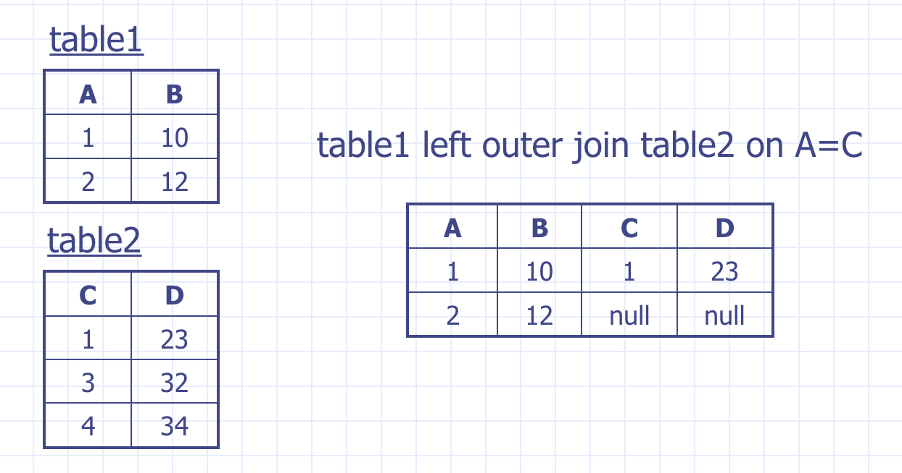
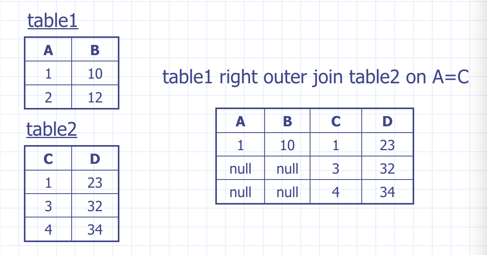
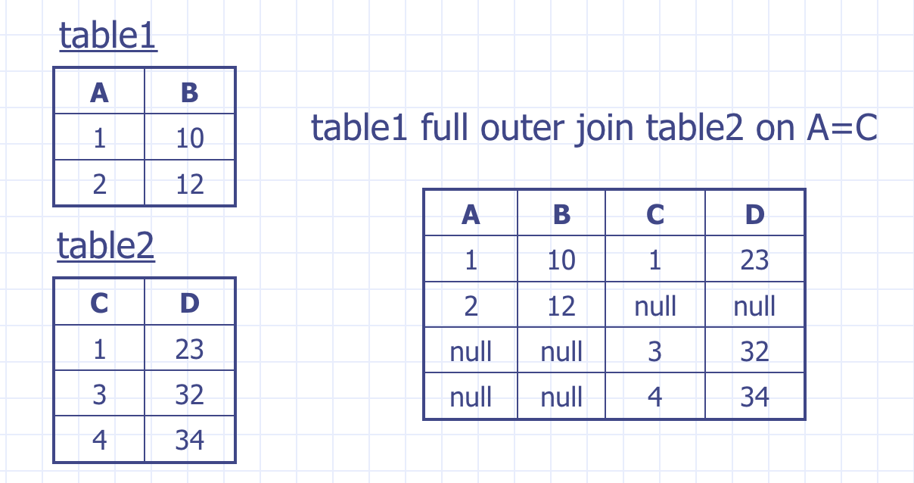
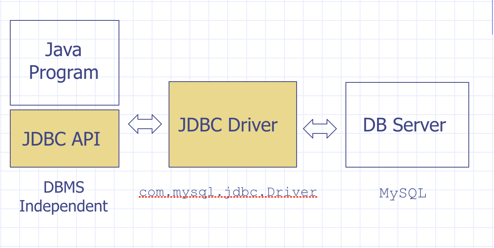
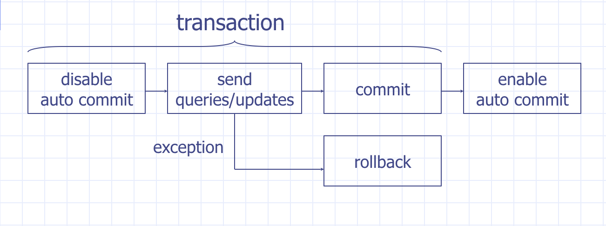

# Database (MySQL)

## Agenda

### Lecture

* [Database in Architecture](#database-in-architecture)
* [Database Terminology](#database-terminology)
    * [DBMS](#dbms)
        * [Database and Schema](#database-and-schema)
    * [Table](#table)
* [SQL](#sql)
    * [SQL Script](#sql-script)
    * [MySQL](#mysql)
    * [Client-server architecture of MySQL](#client-server-architecture-of-mysql)
* [MySQL Setup](#mysql-setup)
    * [Run SQL Scripts](#run-sql-scripts)
* [Schema Design Example](#schema-design-example)
    * [Simple Schema Design Rules](#simple-schema-design-rules)
    * [Create table](#create-table)
    * [Naming Conventions](#naming-conventions)
    * [Create operation](#create-operation)
    * [Read operation](#read-operation)
    * [Update operation](#update-operation)
    * [Delete operation](#delete-operation)
    * [Drop tables](#drop-tables)
    * [Employees DBB](#employees-dbb)
        * [employees](#employees)
        * [projects](#projects)
        * [project_members](#project_members)
    * [Examples: Single-table selection](#examples-single-table-selection)
    * [SQL Literals](#sql-literals)
    * [SQL Operators](#sql-operators)
    * [Like](#like)
    * [Common functions in Databases](#common-functions-in-databases)
    * [Examples: Join](#examples-join)
        * [Cross Join](#cross-join)
        * [Equi-Join](#equi-join)
        * [Inner join](#inner-join)
    * [Examples: Outer Join](#examples-outer-join)
    * [Outer Joins](#outer-joins)
        * [Left Outer Join](#left-outer-join)
        * [Right Outer Join](#right-outer-join)
        * [Full Outer Join](#full-outer-join)
    * [Example: Aggregation Functions](#example-aggregation-functions)
    * [Aggregation Functions](#aggregation-functions)
    * [Example: Aggregation Queries](#example-aggregation-queries)
    * [Understanding Group By](#understanding-group-by)
        * [How group works](#how-group-works)
    * [Even more SQL](#even-more-sql)
* [JDBC](#jdbc)
    * [Example: HelloJDBC.java](#example-hellojdbcjava)
    * [JDBC Basics](#jdbc-basics)
    * [DB Query Results](#db-query-results)
    * [JDBC ResultSet -- Row Access](#jdbc-resultset----row-access)
    * [Common code for processing ResultSet](#common-code-for-processing-resultset)
    * [JDBC ResultSet -- Column Access](#jdbc-resultset----column-access)
    * [JDBC ResultSet -- Access Column Names](#jdbc-resultset----access-column-names)
    * [Handle Exceptions](#handle-exceptions)
    * [Example: GuestBook (JDBC) -- display](#example-guestbook-jdbc----display)
    * [Example: GuestBook (JDBC) -- add](#example-guestbook-jdbc----add)
    * [Example: SQL Injection Attack](#example-sql-injection-attack)
    * [Prepared statements](#prepared-statements)
    * [Beyond basic](#beyond-basic)

### Resources

* http://www.sohamkamani.com/blog/2016/07/07/a-beginners-guide-to-sql/
* https://zeroturnaround.com/rebellabs/sql-cheat-sheet/
* https://blog.codinghorror.com/a-visual-explanation-of-sql-joins/
* http://www.tutorialspoint.com/sql/
* https://gist.github.com/hofmannsven/9164408

### Lab

* Set up MySQL
* SQL Scripts (Create, read, update, delete)
* Store information in database

## Database in Architecture


We have learned how to use back end technology with Java Servlet and JSP to
display data from the backend server. However, after a server restart, your data
is not persisted anyway. In other word, your data will be reset to the data state
that you set at the `init` method.

In this lecture, we will learn how to set up database so that our data doesn't
get lost at server restart. In additional, we will ensure the data is stored in
efficient way by using known DBMS like MySQL.

## Database Terminology

### DBMS

**DBMS** (Database Management System) is a software that manages database.

There are some known DBMS out there:

* Commercial -- Oracle, MS SQL Server, MS Access 
* Open source -- MySQL, PostgreSQL

#### Database and Schema

* A **database** is a collection of data managed by DBMS.
* In MySQL, sometimes database is also called **schema**.
* A database usually contains a number of objects (aka. schema elements) such as
indexes, stored procedures, and so on.

### Table

* **Table** represents relation
* **Attributes** represents fields or columns



## SQL

SQL stands for Structured Query Language. And it's a standard query language used
for relational database. Most of all, it's supported by all major databases with
some variants.

### SQL Script

SQL script on the other hand is a text file contains SQL statements and comments.

* Statements: `select`, `insert`, `create`
* Comments: `--` for line comment or `/* */` for block comments

> Usually uses the ".sql" suffix.

### MySQL

Very popular in web development due to few reasons:

* Open source
* Very fast search
* Full text indexing and search
* Developer-friendly features
    * `drop table if exists`
    * `insert ... on duplicate key`
    * `/* */`
    * ...

> A side note on MySQL runtime on CS3 server. It's using version 5.7. And you have
one database per account.

### 

-server architecture of MySQL



## MySQL Setup

See https://github.com/csula/Utilities/blob/master/setups/mysql.md for setting up
MySQL.

> Please note that you also have a remote CS3 server you can connect to using the
same username and password I gave to you earlier.

### Run SQL Scripts

* Command line client:
    * `$ mysql -u username -p password databasename < path/to/script.sql`
    * `mysql > source path/to/script.sql;`
* MySQL Workbench
    * SQL Editor -> File -> Open SQL Script -> Execute

## Schema Design Example

We will be using Employee and Project as starting example:

```java
public class Employee {
    Integer id;
    String firstName;
    String lastName;
    String address;
    Employee supervisor;
}

public class Project {
    Integer id;
    String name;
    Employee leader;
    Set<Employee> members;
}
```

### Simple Schema Design Rules

| Object Oriented | Relational Database |
| :-- | :-- |
| Model Class | Table |
| Class variables | Attributes |
| Java types | SQL Types |
| Object References | IDs |
| Collection | New Table (possibly) with references back to parent table |

### Create table

Example of create table syntax can be found below:

```
/*
CREATE TABLE table_name (
    field_name field_types [constraint(s)],
    field_name field_types [constraint(s)],
    ...
);
*/

CREATE TABLE employees (
    id INTEGER AUTO_INCREMENT PRIMARY KEY,
    first_name VARCHAR(255) NOT NULL,
    last_name VARCHAR(255) NOT NULL,
    address VARCHAR(255),
    supervisor_id INTEGER REFERENCES employees(id)
);
```

* Field types:
    * integer, float, double, char(n), varchar(n)
    * date, time, datetime, timestamp
* auto_increment
* Integrity constraint
    * unique, not null, primary key
    * foreign key

### Naming Conventions

* Use plural form for table names
* Use singular form for column names
* Use underscore to concatenate multiple words, e.g. `employee_name`

> Don't use mixed cases in names (e.g. ArtistName) because many DBMS treat names
as case-sensitive

### Create operation

Lets start by looking at some examples that will populate data into table:

```sql
// INSERT INTO ... VALUES ...
INSERT INTO table_name VALUES (value1, value2);

INSERT INTO table_name (field_name, field_name) VALUES (value1, value2);

// if you want to insert multiple rows:
INSERT INTO table_name (field_name, field_name) VALUES (value1, value2), (value1, value2);
```

### Read operation

```sql
SELECT field_name(s) FROM table_name(s) WHERE condition(s);
```

### Update operation

```sql
UPDATE table_name SET field_name=value [,...]
WHERE condition(s);
```

### Delete operation

```sql
DELETE FROM table_name WHERE condition(s);
```

### Drop tables

```sql
DROP TABLE table_name:
DROP TABLE IF EXISTS table_name;
```

### Employees DBB

#### employees

| id | first_name | last_name | address | supervisor_id |
| :-- | :-- | :-- | :-- | :-- |
| 1 | John | Doe | Street #215 | null |
| 2 | Jane | Doe | Street #711 | 1 |

#### projects

| id | name | leader_id |
| :-- | :-- | :-- |
| 1 | Firestone | 1 |
| 2 | Blue | 2 |

#### project_members

| project_id | employee_id |
| :-- | :-- |
| 1 | 1 |
| 2 | 1 |
| 2 | 2 |

### Examples: Single-table selection

1. List the last names of the employees whoes ids are less than 10
    * Remove duplicates
    * Show results in alphabetical order
2. Find the id of Jane Doe
3. Find the names of the employees who do not have a supervisor
    * Concatenate first name and last name

### SQL Literals

* Numbers: `10, 30.2`
* String: `'CPU', 'John\'s Kitechen`
* Date: `2007-06-01`
* Time: `12:00:00`
* Boolean: `1, 0, true, false`
* `NULL`

### SQL Operators

* Arithmetic
    * `+, -, *, /, %`
* Comparison
    * `<, >, <=, >=, =, <>`
    * `between`
* Logical
    * `and, or, not`
* String
    * `like`
* Other
    * `is null`
    * `in`
    * `distinct`
    * `order by`

### Like

Like is a simple pattern matching operator:
    * `%`: to match any zero or more characters
    * `_`: to match any **single** character

### Common functions in Databases

* Numerical functions
* String functions
* Date and time functions
* NULL related functions
* Aggregation functions

> Please refers to https://dev.mysql.com/doc/refman/5.7/en/functions.html

> CS-1222 notes: https://github.com/csula/cs1222-fall-2016/blob/master/notes/sql-functions.md

### Examples: Join

4. List the employees who work on the project with id=1
5. List the employees who work on the project "Blue"
6. Find the name of Jane Doe's supervisor

#### Cross Join

* Aka. Cartesian Product
* The results are all possiblbe combinations of the rows from table 1 with
rows from table 2



#### Equi-Join

* Cross join with additional conditions

```sql
SELECT ... FROM table_1, table_2 WHERE ... ... ...;
```

#### Inner join

* Aka. the join
* Combine two rows (one from each table) if they meet the join condition
* In other words, the results include the matching rows from the two tables



### Examples: Outer Join

7. Find the employees who are not working on any project

### Outer Joins

* Include the results of an Inner Join and the unmatched rows from one or
both join tables

#### Left Outer Join

* Aka. Left Join



#### Right Outer Join

* Aka. Right Join



#### Full Outer Join

* Aka. Full Join



### Example: Aggregation Functions

8. Find the number of employees whoes last name is "Doe"

### Aggregation Functions

* Operate on multiple rows and return a single result
    * `sum`
    * `avg`
    * `count`
    * `max` and `min`

> Please be careful with null value with above function.

### Example: Aggregation Queries

9. List the number of employees for each project
    * Order the results by the number of the employees
10. List the number of projects each employee works on

### Understanding Group By

* Without aggregation/Group By, you will see the result not grouped.

#### How group works

1. Calculate the results without aggregation/group by
2. Divide the result rows into groups that share the same value in the grouping attribute(s)
3. Apply the aggregation function(s) to the aggregation attribute(s) for
each group

### Even more SQL

* Subquery
* Set operations
* Top N query
* Transactions

## JDBC

JDBC is an interface that defines the SQL operations so that specific driver
like MySQL can implement for DB specific functions.



* JDBC stands for Java DataBase Connectivity
* JDBC API is DBMS indepedent
* JDBC Driver implements JDBC API for a particular DBMS

### Example: HelloJDBC.java

* Load JDBC Driver
* Make Connections
* Execute queries
* Process results
* Handle exceptions (and close connections)

### JDBC Basics

* `import java.sql.*;`
* Initialize driver
    * Class.forName("com.mysql.jdbc.Driver")
* Create connection
    * URL
        * `jdbc:mysql//[host:port]/[databbase][?user=cs3220xstu25&password=abcd]`
    * DriverManager.getConnection( URL )
    * DriverManager.getConnection( URL, user, pass )
* Create statement
    * `Statement stmt = c.createStatement();`
        * `stmt.executeQuery(String sql)`
        * `stmt.executeUpdate(String sql)`
* Get result back
    * ResultSet

> Refer to http://docs.oracle.com/javase/tutorial/jdbc/index.html

### DB Query Results

* In a program, we usually want to:
    * Access each record
    * Access each attribute in a record
    * Access the name of each attribute

### JDBC ResultSet -- Row Access

Each record(cursor) is a row in the DBMS table.

You can call `next()` method to move cursor one row down:
    * Cursor starts before the first record
    * `true` if the current record is valid
    * `false` if there is no more records

### Common code for processing ResultSet

* Process each row: `while (rs.next()) { ... }`
* Check whether a result set is empty: `if (rs.next()) { ... }`

### JDBC ResultSet -- Column Access

* Access the columns of current row
* getXxx(String columnName) to get column value in Xxx type
    * e.g. `getString("first_name")`
* getXxx(int columnIndex) to get column value by the index
    * columnIndex starts from 1
    * e.g. getString(1)

> Check http://docs.oracle.com/javase/7/docs/api/java/sql/ResultSet.html for more detail

### JDBC ResultSet -- Access Column Names

```java
ResultSetMetaData meta = rs.getMetaData();
```

* ResultSetMetaData
    * getColumnName( columnIndex )
        * Column name
    * getColumnLabel( columnIndex )
        * Column title for display or printout

### Handle Exceptions

When opening JDBC connection, you will need to handle various exceptions (potential
runtime errors such as SQL statement isn't valid or MySQL isn't there).

```java
catch (SQLException e) {
    throw new ServletException( e ); // to have Servlet to display error stack (dev only)
} finally {
    try {
        if (c != null) c.close();
    } catch (SQLException e) {
        throw new ServletException(e);
    }
}
```

### Example: GuestBook (JDBC) -- display

* Create a "guest_book" table
* Retrieve the entries in a Servlet
* Display the entries in a JSP

### Example: GuestBook (JDBC) -- add

* Save a new guest book entries to the databbase
    * `executeQuery()` vs `executeUpdate()`
* Potential problems of handling user input
    * Special characters
    * SQL Injection Attack

### Example: SQL Injection Attack

* User input should never be trusted
* Malicious user input
    * Username: someuser
    * Password: something' OR ' 1
* Prevent SQL injection attack?
    * User prepare statement

### Prepared statements

Prepared statements is statements with parameters.

```java
String sql = "INSERT INTO items VALUES (?, ?, ?)";

PreparedStatement pstmt = c.prepareStatement(sql);

pstmt.setString(1, "orange");
pstmt.setBigDecimal(2, 0.59);
pstmt.setInt(3, 4);

pstmt.executeUpdate();
```

### Beyond basic

* Transaction
    * ACID property of database



It's rather expensive to open a db connection; in fact, we can keep connections
open and reusabble through **connection pool**.

Connection pool can define:

* Max number of connections
* Max number of idle connections
* And many other configurable parameters

> See http://tomcat.apache.org/tomcat-8.5-doc/jndi-datasource-examples-howto.html for more detail

Besides connection pool, we also are doing a lot of conversion ourselves from
ResultSet to our business object (plain old Java Class). There is a library
to help us to map between ResultSet and Object through **Object-Relational Mapping** like Hibernate -- http://hibernate.org/orm
