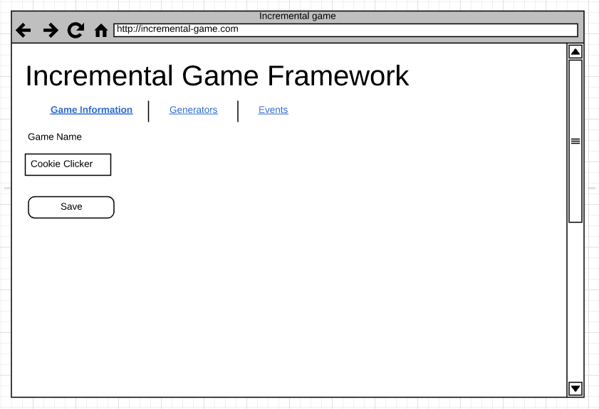

# Exercise 2

## Deliverables

* Implement Game Information Configuration page
* Implement Game Generators Configuration page
* Implement Game Events Configuration page
* CSNS Submission containing link to the pull request as below

```
https://github.com/csula-students/cs-3220-spring-2018-rcliao/pull/1
```

## Descriptions

In this exercise, we will apply the knowledge we learned from the HTML and CSS
lecture into practice.

To do so, we will implement a couple pages that we will use later in the project.
These are:

* An administration page to control game information (such as game name)
* An administration page to control the game generators meta information
* An administration page to control the game events meta information

The provided mockups can be found below:




## Technical

For the technical requirements wise, you will need to implement a couple different
HTML pages. One is called `admin-info`, one called `admin-events` and last one
called `admin-generators`.

Although functionalities does not need to work just yet. It's important to have
the HTML and CSS there for the sake of this exercise.

### Functional requirements

Students are welcome to change their design on what they think it's the best for the
project under these functional requirements:

* On the game information page, user should be able to update the game name
* On the events meta information page, user should be able to create new meta containing the following information
    * Event name
    * Event description
    * Event trigger at
* On the events meta information page, user should be able to see a list of events that was created
* On the generator meta page, user should be able to create new generator containing the following information
    * Generator name
    * Generator rate
    * Generator base cost
    * Generator unlock at
    * Generator description
* On the generator meta page, user should be able to see a list of generators that was created
* On every page (game information, event meta & generator meta), user should see a *navigation bar* to go between pages
