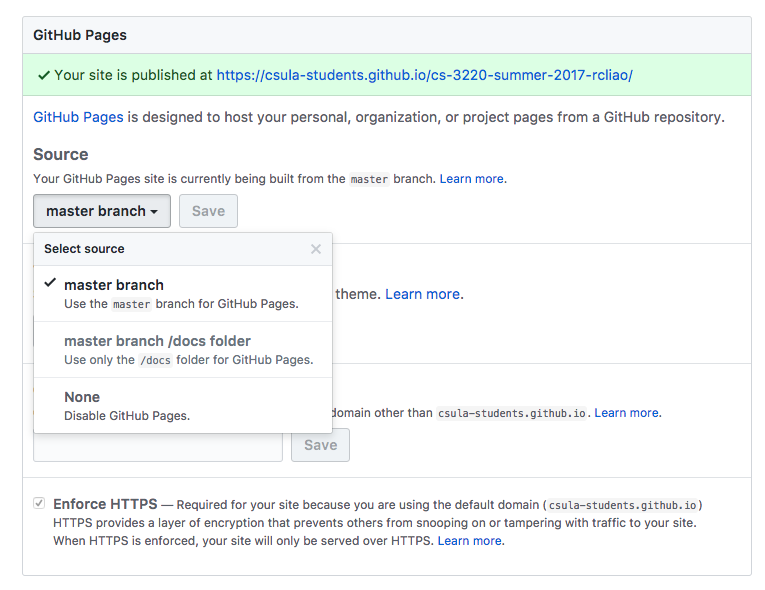

# Exercise

## Deliverables

* Button component (styled)
* Table component (styled)
* Form component (styled)
* Submit Github pages URL to CSNS under exercise

## Note to students

Since this is the first week and the first lab, we will do a practice exercise
to get you ready for the actual lab. Even though this lab is non-graded, I
strongly recommend you to finish this lab.

## Description

We want to start simple by creating a couple HTML components and show them on the
Github pages. This exercise will ensure you to have Git/Github as well as the
text editor set up in order to do the HTML & CSS programming.

After this exercise, you will get a feeling of the whole laboratory.

> Remember, if you are lost in any of the step, feel free to ask questions.

In concrete, in this exercise, we want to set ourselves up to our game
application. The first step we want to do is to create the building block
of the front end – components.

## Requirements

* Create a button component
	* Ensure to have different modifiers (primary and secondary)
* Create a table component
	* Display a list of items
* Create a form component
	* Form to create/edit a generator/event
	* Remember to use the button we created earlier above
* Push changes to Github pages
* In the Github page, it should display all components created above.

## Instructions

### Set ups

Before you can start the whole exercise, make sure you have
[introduction.md](../introduction.md) opened and ready.

You will need your development environment (text editor & Git) ready.

Secondly, you will need a Github account from https://github.com if you don't
already own one.

And then you will need to clone your repository down to your local computer.

```
git clone {your repository url}
```

### Get started

To get started, you can start by making a file called `index.html`. Lets put
some dummy content inside first so that we can see something.

```html
<!DOCTYPE html>
<html lang="en">
<head>
	<meta charset="UTF-8">
	<title>CS 3220 Practice Lab</title>
</head>
<body>
	<h1>Hello world!</h1>
</body>
</html>
```

From here, you can open up this `index.html` in your favorite text editor and
start hacking!

### First component – Button

The first component we want to create is a simple button. Lets start simple.

A button can be started like below:

```html
<button>A button</button>
```

Your task is to define your button style to apply to such button. As example:

```css
button {
	color: #fff;
	background-color: #009688;
	font-size: 16px;
	padding: 0.5em 1em;
}
```

If you don't know what color to pick, don't worry you can use this tool to
select color by Google Material team:

https://material.io/color/

### Second component -- Table of generators

We will explain *generators* concept starting next week. For now, follow the mock
up and define three items as below.

You can start as followed:

```html
<table>
	<thead>
		<tr>
			<th>Name</th>
			<th>Rate</th>
			<th>Cost</th>
		</tr>
	</thead>
	<tbody>
		<tr>
			<td>Grandma</td>
			<td>5</td>
			<td>10</td>
		</tr>
		<tr>
			<td>Factory</td>
			<td>10</td>
			<td>50</td>
		</tr>
		<tr>
			<td>Mine</td>
			<td>20</td>
			<td>200</td>
		</tr>
	</tbody>
</table>
```

And after you have the content filled in the table, you want to start styling
your table!

```css
table {
	border: 1px solid red;
}
tr {
	background-color: #ccc;
}
```

### Third component -- forms

Forms probably defines the main interaction your users have on your interactive site.

To get form started, you want to start your HTML content as below:

```html
<form action="">
	<label for="name">Name</label>
	<input type="text" id="name">
	<!-- add more necessary information you need for creating additional recipes -->
</form>
```

And same as above, you want to style your forms!

```css
input {
	font-size: 16px;
	padding: 0.5em 1em;
}
```

### Push changes to Github page

To do so, you will need to make a **commit** locally and **push** your
changes onto your student Github repository.

To make a commit and push changes, open Git bash:

```sh
# Add all changes
git add .

# Commit changes
git commit -m "{Describe your changes}"

git push
```

Once you pushes all your changes to Github repository. Then, you 
can go ahead and configure out your own Github settings.


