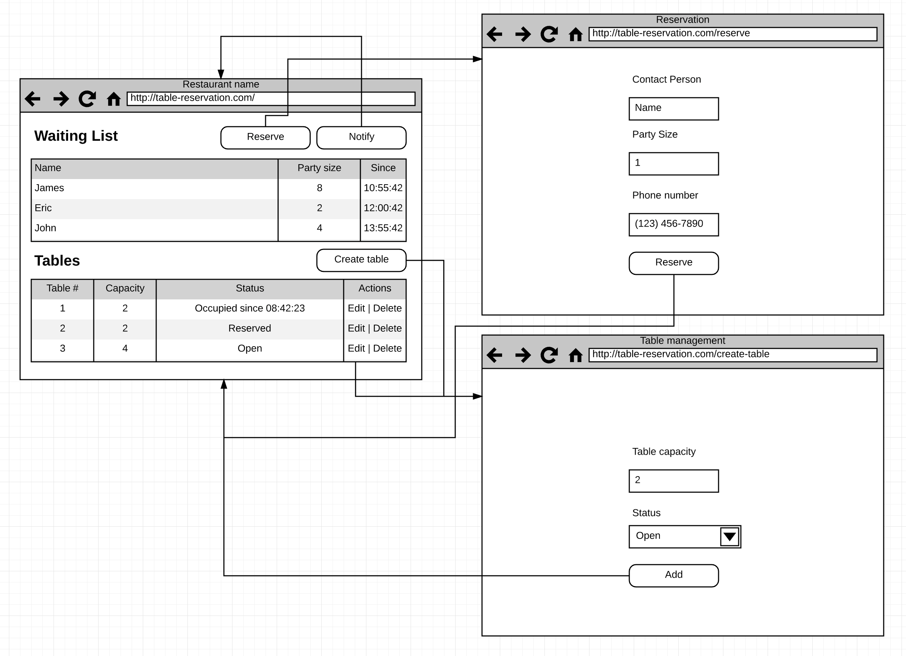

# Final

## Deliverables

* CSNS text submission of application address and pull request
* schema.sql
* app.css
* Necessary Java DAOs
* Necessary Java Servlets & JSPs
* Necessary Java Jersey Resource

## Due date time

### August 12th 13:30:00

## Description

We will build **an table reservation system** for our restaurant applications to
manage restaurant open tables.

On the technical side, you will need to use all the technologies we have learned
throughout the entire semester, namely:

* HTML & CSS
* Java Servlet
* JSPs
* JDBC & MySQL
* Jersey to build RESTful services

The application will require you to build multiple small set of applications:

1. Design business models
2. Design the database schema
3. Implement the `schema.sql`
4. Create Database Access layer with DAO abstraction
5. Create Java Servlet and JSP to display control panel
6. Style above pages with CSS
7. Create Jersey Service layer
8. Connect Jersey Service layer with JavaScript code to create notification
9. Profit!

### Business model

In this section, we will be talking about central business model for the table
reservation application:

You will need at least following:

* Reservation
* Table

#### Reservation

* ID
* Contact Name
* Contact Number
* Status (enum of "queue", "waiting" or "done")
* Party size (int)
* Since (date time)

#### Table

* ID
* Capacity (int)
* Status (enum of "open", "occupied" or "reserved")
* Last modified (date time)
* Occupied by (Refers to a reservation)
* Reserved By (Refers to a reservation)

> For reserved by field, see the **notify process** below

**Hint**

From the business model above, you should start by creating database table schema.
In other word, it's highly recommended to start designing the schema on the pen
and paper; and you can think it through to see if the schema containing all the
necessary scenarios.

After you have the table defined, you will want to start by defining the DAOs
(Database Access Object) for each business models you have.

Finally, after you finished the DAO implementations, you can move onto the
controller layer below!

### URL Patterns

To make the application easily testable by me, you will need to follow the URL
patterns explicitly:

| URL | ServletName | Description |
| :-- | :-- | :-- |
| GET /reservation | TableReservationsServlet | Display reservation homepage as above |
| GET /reservation/reserve | TableReservationFormServlet | Display the reservation form for customer to reserve |
| POST /reservation/reserve | TableReservationFormServlet | Handle creating reservation process and redirect back to "/reservation" |
| GET /reservation/admin | ReservationAdminServlet | Display adimn control panel to see reservation status and notify customer |
| GET /reservation/admin/table/create | ReservationCreateTableServlet | Display table creation form |
| POST /reservation/admin/table/create | ReservationCreateTableServlet | Handle table creation process and redirect back to admin panel |
| GET /reservation/admin/table/edit?id | ReservationEditTableServlet | Display form to edit table status |
| POST /reservation/admin/table/edit?id | ReservationEditTableServlet | Edit certain table status |
| POST /reservation/admin/table/delete?id | ReservationDeleteTableServlet | Delete certain table given id |
| POST /reservation/admin/notify | ReservationNotifyServlet | Handle **notify process** (see below for more detail) |

**Hint**

You will probably need several Servlets and JSPs, make sure they are all created
and able to navigate around first with only dummy content; then, you can start
adding more and more functionalities one by one!

### Notify process

The most important piece of the table reservation application is its notify process.
That is -- the application need to go through the table list given certain logic:

1. Find the first *queued* customer (sorted by since date/time -- first come first serve)
2. For this customer, find the next *opening* table (the capacity must meet the party size)
    * If the customer size is too large, you then must find multiple available tables
    * If the application cannot find the available table for this customer, mark the closest occupied table (sorted by lastModified) as reserved for this customer to find next available customer
3. Once the customer is found, modify the reservation status to either "waiting" (if the customer is put on wait because there is no available table) or "done" (if customer is occupied with certain table already)
    * Remember to also modify the table status to be either occupied or reserved by this customer

### RESTful Services

After you finished the above requirements (being able to reserve table and notify
the next available customer), you can then work on the RESTful service using
Jersey with following URLs:

| URL | ServletName | Description |
| :-- | :-- | :-- |
| POST /services/reservations | ReservationResource | Allow reservation to be made by RESTful service |
| GET /services/reservation/:id | ReservationResource | Display the status for the certain reservation |
| GET /services/tables | ReservationResource | Display a list of table with their status |

#### Extra fun

After you have finished the requirements above (especially on the RESTful services),
you should be able to move the `final/static` folder into your WebContent to see
the smooth integration between the front end application I built into your
RESTful services.

It should look like http://165.227.17.62:9000/

> This link will probably stay open until a couple days later until I shut down
> my server, but if you want you can open up the index.html with proper backend
> implementation.

## Requirements

* Java Servlets should not be outputing any HTML string, and the JSP should not be doing any processing
* App should be styled with app.css
* Customer should be able to make reservation and see reservation show up on the wait list
* Admin should be able to create/update table status
* Admin should be able to notify the next customer smartly (with notify process above)
* There should be RESTful services end point available for integration
* Pull request should only contain the necessary changes (e.g. no previous assignments changes)

