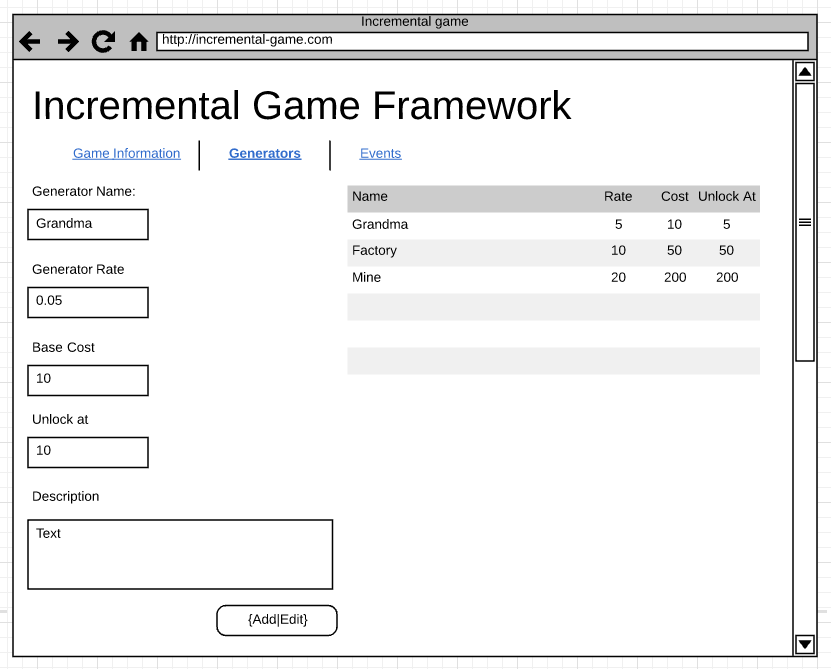
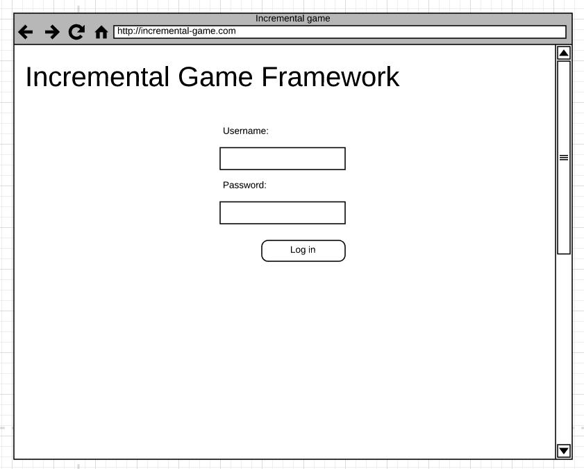

# Homework 3

## Deliverables

* Single txt file containing link to **the pull request** and **CS3 application**

* `admin-generator.jsp`
* `admin-authentication.jsp`
* `game.jsp`
* `src/main/webapps/app.js`
* Deploy to CS3 server
* Refactor events configuration page to use JSP

## Descriptions

In this lab, we will continue the implementation of homework 2 to transform our
`out.println` method to use JSP instead.

As reminder, generator admin page and authentication page look like below:




Additionally, starting from this homework, we will work on the *integration*
between the meta data and the game we created back in lab 1 and 2.

To do so, we need to pass the data we get from the DAO (database access object)
to the front end in JSP in a specific format called
[JSON](https://www.json.org/) so that the JavaScript code can read the data to
store the information into JavaScript variable. In example, at somewhere in the
`game.jsp` should containing similar snippet as below:

```
<script>
    window.game = {};
    window.game.state = ${state}; // where state is passed from Controller as JSON string
</script>
```

We will serialize Java object to JSON String using a library called
[GSON](https://github.com/google/gson) created by Google. But, we will need to
learn how to import external library into our Java web application. Luckily, we
have set up Gradle to manage the dependency for local development environment.

In your `build.gradle` file, you should add a line in the _dependencies_ block:

```
dependencies {
    compile 'com.google.code.gson:gson:2.8.2'
}
```

And once you added the _compile_ line over to your dependencies block, you can
then use GSON in your controller code like:

```
import com.google.gson.Gson;
import com.google.gson.GsonBuilder;

public Controller {
    public void doGet () {
        DTO dto = new DTO();
        GsonBuilder builder = new GsonBuilder();
        Gson gson = builder.create();
        String jsonString = gson.toJson(dto);
    }
}
```

> Or find working example in this commit: https://github.com/rcliao/cookie-clicker/commit/70e16c16407c9d00de7fc3f0646aea10f64a82a9

Once you have the JSON string, you can pass the JSON string back to the
`game.jsp` file in the _request scope_ and render such JSON string in the _script_
tag to pass JSON information to JavaScript.

From there, your `app.js` (that was created back in lab 2) should be able to take
this meta information (containing of events and generator data) to render events
and generators correctly.

However, Gradle doesn't cover up the deployment to CS3 server. In order for the
GSON to work in CS3, you will need to upload [GSON JAR
file](https://github.com/rcliao/cookie-clicker/raw/master/lib/gson-2.8.2.jar)
to `www/WEB-INF/lib` for cs3 server to get GSON working.

## Requirements

### Functional

* Application should perform the same as homework 2
* Game should be working under `/game` end point

### Technical

* All presentation code should go to JSP
* JSP should be hidden under `WEB-INF` folder (not accessible directly)
* No HTML output in Servlet (no `out.println`)
* No Java code in JSP (no computation in JSP)
