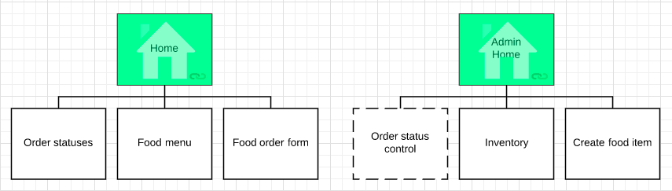
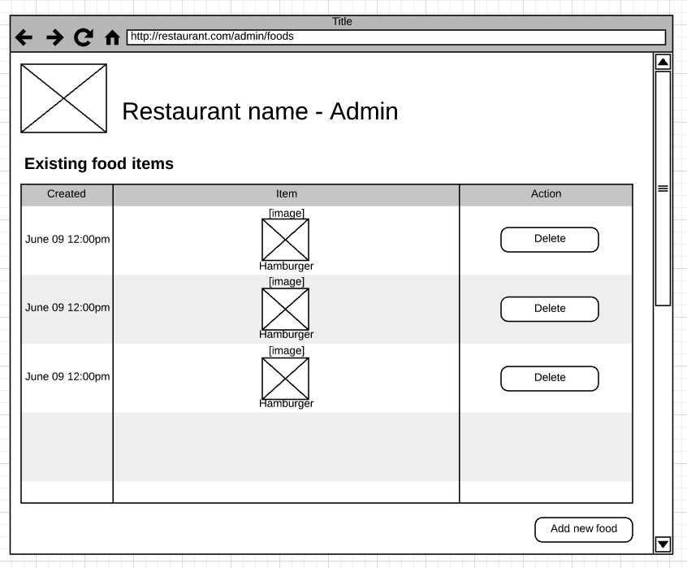
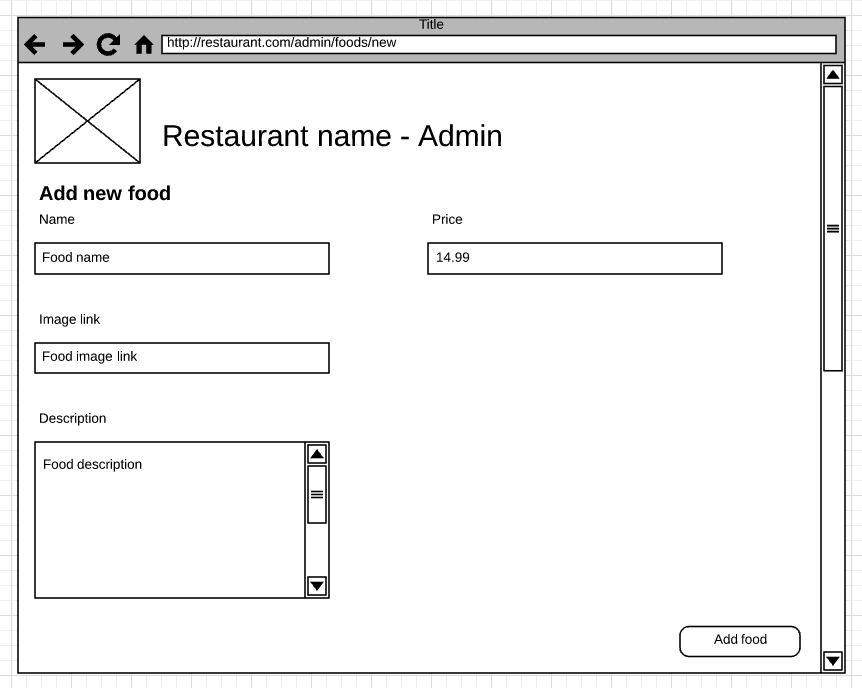
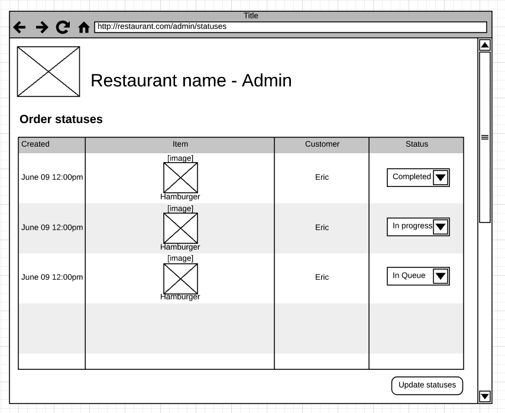

# Homework 3

## Deliverables

* Deploy to CS3 server
* index.jsp (menu) [3 pts]
* order.jsp [3 pts]
* statuses.jsp [3 pts]
* app.css [2 pts]
* All requirements below must be met [2 pts]

## Due date time

### July 22nd 23:59:59

## Description

Your job here is to continue refactoring the existing application using JSP/JSTL.
By now, you should have most of the application written in Java Servlet with
rendering the HTML output in the `out.println`. In specific, you will need to
separate out the presentation concern into using JSP & JSTL.

There are a couple pages we have been working through so far:

* index.jsp (which is the same as food menu.jsp)
* order.jsp
* statuses.jsp
* admin/inventory.jsp
* admin/create-food.jsp

If you don't remember the mockup, this may be a refresher:

## Requirements

* Functional requirements stays the same from before:
	* Customer should be able to go to menu and start ordering foods
		* Checkout button should work so that it will add item to cart
	* Customer should be able to go to order to finish his/her order
		* Items should be coming from the menu (checkout button)
	* Customer should be able to go to statuses to see up to date statuses
		* Once order is accomplished, it should default to `IN QUEUE` status
	* Admin should be able to create new food from the create food form
		* New item should also show up under menu
	* Admin should be able to see its food inventory from the inventory page
		* Inventory page should show a list of food items
	* Admin should be able to adjust the order statuses from the order-statuses
		* Upon change of status, the statuses from customer end should see up
		to date status
* Technical requirements:
	* All presentation logic should be done in JSP.
	* No Java processing is allowed in JSP
	* Request should be sent to controller and not to JSP directly
	* Servlets should not generate HTML output

> Note that by now your application should be able to accomplish all requirements
as above. If your application cannot do any of the above, please finish it as
part of this homework.
