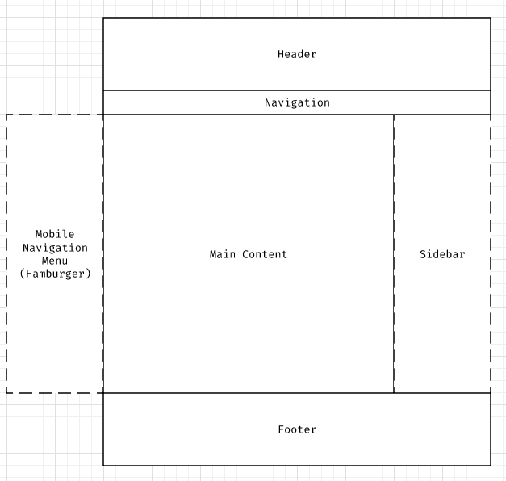
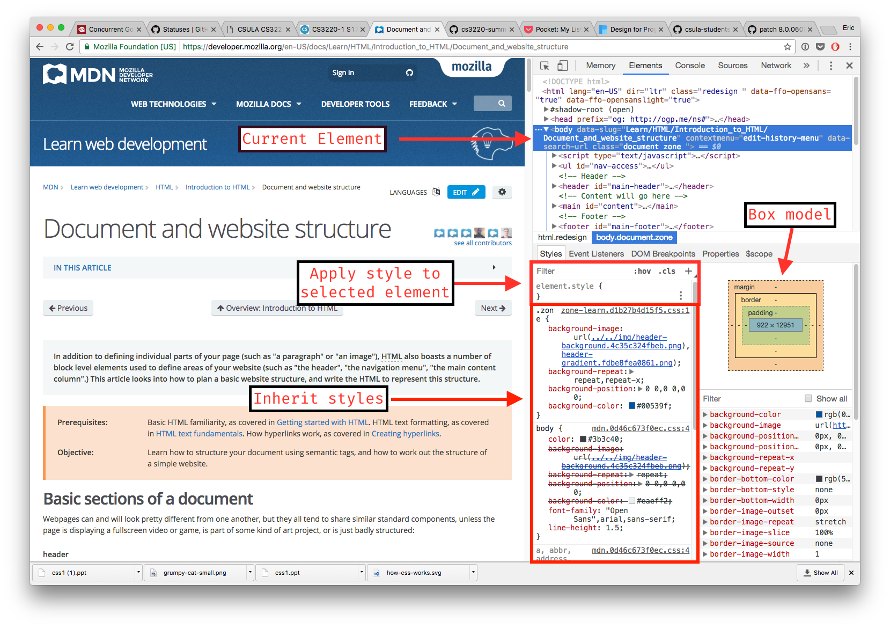
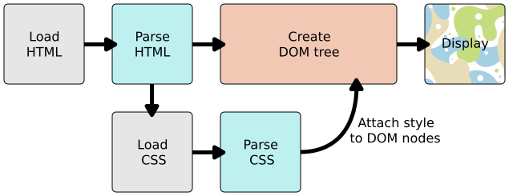
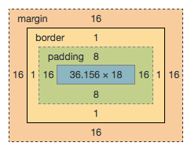

# HTML & CSS

## Agenda

### Lecture

* Intro to HTML
	* Semantic HTML
	* Document and website structure
* Chrome debugging
* Intro to CSS
	* CSS Selector
	* CSS Syntax
* Exercise sample
    * [box-sizing](https://css-tricks.com/box-sizing/)
    * [Table styling](https://css-tricks.com/complete-guide-table-element/)
    * Basic layout
* DOM
* Responsive design
    * Flexbox
* CSS Frameworks
* CSS Mythology

### Lab

#### [Exercise 2](./exercises/exercise-2.md)

* Create Incremental Game administration pages
    * Game information
    * Events meta
    * Generator meta

#### [Lab 1](./labs/lab1.md)

* Create the game public facing page
    * Implement base on mockup

## Intro to HTML

HTML is not a programming language, it's a mark up language.

> At its heart, HTML is a fairly simple language made up of elements, which can be applied to pieces of text to give them different meaning in a document (is it a paragraph? is it a bulleted list? is it part of a table?), structure a document into logical sections (does it have a header? three columns of content? a navigation menu?) and embed content such as images and videos into a page. This module will introduce the first two of these, and introduce fundamental concepts and syntax you need to know to understand HTML.

Reference: https://developer.mozilla.org/en-US/docs/Learn/HTML/Introduction_to_HTML

### Syntax

* Open tag
* Close tag (sometimes tag are self closing)
* Content
* Can be nested
* [Optional] Attributes

```html
<p>This is a paragraph<p/>
<!--
<p> is the open tag
"This is a paragraph" is the content
</p> is the close tag
-->
```

```html
<article>
	<h2>Article title</h2>
	<p>Article content</p>
</article>
```

All above combine to establish an **element** under this element, there are two
child elements under the `artitle` element.

### Block vs Inline elements

```html
<em>Inline element</em>
<em>Inline element</em>
<em>Inline element</em>

<p>Block element</p>
<p>Block element</p>
<p>Block element</p>
```

### Attributes

```html
<a href="https://google.com" title="Google">link to Google</a>
```

#### Boolean attribute

```html
<button disabled="true">Disabled button</button>

<button disabled>Disabled button</button>
```

### Side notes to HTML

**Spaces** in HTML

```html
<p>Cats are grumpy</p>

<!-- above is the same as below -->

<p>Cats                           are
grumpy</p>
```

No matter how many spaces you put between words, HTML will always trim it down to
one space.

> If you insist to put more spaces, you may put `&nbsp;` as literal space

**HTML Special Characters**

What if you want to put some special characters in HTML like `<`, `>`?

| Character | Reference |
| --- | --- |
| < | `&lt;` |
| > | `&gt;` |
| " | `&quot;` |
| ' | `&apos;` |
| & | `&amp;` |

### HEAD element

Head section is usually not displayed to end user but to mostly hold meta 
information and define assets.

In example:

```html
<!DOCTYPE html>
<html lang="en">
<head>
	<!-- custom icon -->
	<link rel="shortcut icon" href="favicon.ico" type="image/x-icon">
	<!-- character encoding -->
	<meta charset="UTF-8">
	<title>Title</title>

	<style>
		.internal-style {

		}
	</style>
	<link rel="stylesheet" href="app.css">
	<script src="webcomponents.js"></script>
</head>
</html>
```

What should go under html head section?

See https://github.com/joshbuchea/HEAD for more detail.

For search engine and 3rd party parsing:

* http://ogp.me/

### Text fundamental

#### Headings

h1, h2, h3, h4, h5, h6

#### Paragraph

`<p>`

#### Lists

* Ordered list `<ol>`
* Unordered list `<ul>`
* List item `<li>`

Example:

```html
<ol>
	<li>one</li>
	<li>two</li>
	<li>three</li>
</ol>

<ul>
	<li>item</li>
	<li>item</li>
	<li>item</li>
</ul>
```

#### Emphasize & important

`<em>` vs `<strong>`

#### Italic, bold, underline

`<i>`, `<b>` and `<u>`

### Hyperlink

Hyperlinks are probably by far one of the most important elements in the web.
Besides, without hyperlinks, how does pages form a internet **web**.

A basic hyperlink example can be like below:

```html
<a href="https://google.com">google.com</a>
```

You can add supportive title attribute to the hyperlink:

```html
<a href="https://google.com" title="Google homepage">google.com</a>
```

Note that you can also surround the hyperlink to block element like image:

```html
<a href="https://google.com">
	
</a>
```

#### Absolute path vs relative path

All the example above are using absolute path to link to certain sites. This 
works for the case you are linking to different sites. What about if you want
to link within your own domain?

It's more recommended to use relative path if possible. Relative path example
can be found below:

```html
<a href="about.html">
	About me
</a>
```

What are the advantages of relative path?

* Domain agnostic
* Shorter code

#### Exercise: Navigation menu

We learn quite a lot so far about HTML and many different elements including
the most important element -- hyperlink.

Lets spend some time on applying what we have learned so far to create a 
navigation menu.

It's common for websites to have a navigation bar. Lets pretend we are building
a personal portfolio. We want to have following pages:

* Index.html (homepage)
* About.html (personal information)
* Resume.html (your own resume)
* Projects.html (project show cases)
	* Project.html (individual project detail page)

Don't worry about the content inside of these pages. In fact, lets put their
name within a h2 tag as a placeholder except the projects.html

In project.html, have the following code as example:

```html
<!DOCTYPE html>
<html lang="en">
<head>
	<meta charset="UTF-8">
	<title>Projects</title>
</head>
<body>
	<ul>
		<li><a href="project.html">Project 1</a></li>
		<li><a href="project.html">Project 2</a></li>
		<li><a href="project.html">Project 3</a></li>
	</ul>
</body>
</html>
```

When you are finished with the navigation menu linking to all pages above,
please raise your hand and let me know you are done.

When everyone is finished with exercise, we will move onto the next example.

#### Email link

```html
<a href="mailto:someone@domain.com">Mail to someone</a>
```

#### Link to specific fragment

```
<h2 id="heading_2">Second headline</h2>

<a href="#header_2">Link to second headline</a>
```

### Advance text formatting

There are a lot more elements we can go over for HTML. These are a few common
ones I used:

* Description list
* Blockquote
* Inline quote
* Preformatted text

#### Description list

Description list is a way to show description for a list of items. Example can
be found below:

```html
<dl>                           <!-- Description List -->
	<dt>Item</dt>              <!-- Description Term -->
	<dd>Description</dd>       <!-- Description Description -->
	<dt>Item</dt>
	<dd>Description</dd>
</dl>
```

#### Blockquote

Blockquote is useful when you are referencing to other places.

```html
<blockquote cite="https://developer.mozilla.org/en-US/docs/Web/HTML/Element/blockquote">
  <p>The <strong>HTML <code>&lt;blockquote&gt;</code> Element</strong> (or <em>HTML Block
  Quotation Element</em>) indicates that the enclosed text is an extended quotation.</p>
</blockquote>
```

Also you can use `<q>` to do inline quote

#### Preformatted text

Preformatted text allows you to write "preformatted text" which is being presented
exactly as how it is written.

> it's commonly used to represent source code

```html
<pre>
body {
    font-size: 16px;
}
</pre>
```

### Semantic HTML

Before we move onto the next part of HTML (website structure), I want to spend
sometime to talk about best practices of HTML.

HTML as a language is super forgiving. In a way that you can do something
completely wrong and yet it is still working. It takes discipline to maintain
a good state of HTML code.

A good HTML code is not only good to maintain but also good for web crawler like
Google to understand your page and push your pages content to its search engine.
Moreover, HTML following good standard also provides good usability and
accessibility out of box. In example, Edlio (my company) builds websites for
schools and it's our goal to make sure the website provides ADA compliance.
To do so, we will need to make sure the website is at least keyboard navigable.
We accomplish this by making sure our HTML is following semantic HTML.

You can find semantic HTML article below:
https://codepen.io/mi-lee/post/an-overview-of-html5-semantics

### Document & website structure

Followed by the semantic HTML, the first common use case of semantic HTML is on
document structure as listed below:

* Header `<header>`
* Navigation `<nav>`
* Main content `<main>`
* Side bar `<aside>`
* Footer `<footer>`



A common web page structure can be found as above. A website often has a header
with navigation as part of header, a content area in the center (which usually
changes based on which page you are viewing) and a footer area that probably 
shows the trade mark.

Optionally, you may see sidebar on the right to show more links or more content.

Although not all pages will be in this format of structure, it is common to be
structured like that.

On your homework/lab later, you may consider using this structure as the 
starting point for your page. Consider you have a header, content area, and
footer. What would you love to put in these area?

## Debugging

In programming, it's important to keep iteration small and getting early
feedback. Luckily, in web development, front end development is usually
easy to debug the code through developer console as below.



## CSS Intro

### How does CSS works?



Credit: https://developer.mozilla.org/en-US/docs/Learn/CSS/Introduction_to_CSS/How_CSS_works

By far the most important image I've learned about CSS before is shown above.
Browser as render engine is actually predictable if you know how it parses
the HTML and how it parses CSS rules to form CSSOM.

Browser starts by evaluating the HTML and form a DOM tree. While it's building
the DOM tree, it will also actively fetch for the information out of DOM nodes.
Some DOM node may require browser to make additional requests (e.g. images, link
to fetch external CSS, JavaScript files … etc.). From the request to fetch for
CSS data, it will use the CSS response to construct CSSOM (CSS object model).

With the CSSOM and DOM, browser then can match the CSS and its selected DOM to
display the page.

Another example image can be found below:


Credit: https://developers.google.com/web/fundamentals/performance/critical-rendering-path/render-tree-construction

### Load CSS

There are several ways you can load CSS:

* External
* Internal
* Inline

External means you create a `link` tag to tell browser that the stylesheet is 
somewhere else and browser will make a request to fetch for such stylesheet. 
Example:

```html
<link rel="stylesheet" href="app.css">
```

While internal stlyesheet may be what you've done on the first day of exercise,
you simply wrap your styles in a `style` tag:

```html
<style>
body {
	font-size: 16px;
}
</style>
```

Inline style is when you try to apply style as attribute to DOM directly:

```html
<p style="font-size: 16px; text-align: right;">
	This paragraph will be right aligned with 16px font size.
</p>
```

Good practice is trying to use the external stylesheet as much as possible while
avoiding the inline style.

**Why not inline style?**

You have a hard time to reuse the same style. For example if I want the button
to have a blue background. I need to apply this style attribute multiple times
across multiple buttons. Plus if I change my mind on the button color, I will
need to change several places. All in all, inline style does not promote the
DRY (Do not Repeat Yourself) principle; therefore, it is not recommended to 
do so.

### Syntax

```css
h1 { // selector
// start of block
	// property: value;
	font-size: 24px;
	padding: 0.5em 1em;
	// same as padding: 0.5em 1em 0.5em 1em;
// end of block
}

// responsive media query for mobile screens
@media(max-width: 480px) {
	body {
		font-size: 14px;
	}
}
```

* `property: value;`
* Comments

### Selectors

* Id
* Class
* Tag
* Value attribute
* Pseudo-elements
* Combinators
* Multiple selectors

Pseudo classes:

https://developer.mozilla.org/en-US/docs/Learn/CSS/Introduction_to_CSS/Pseudo-classes_and_pseudo-elements

Selectors combinator:

* The descendant selector —  `(space)` — allows you to select an element nested somewhere inside another element (not necessarily a direct descendant; it could be a grandchild, for example)
* The child selector — `>` — allows you to select an element that is an immediate child of another element.
* The adjacent sibling selector — `+` — allows you to select an element that is an immediate sibling of another element (i.e. right next to it, at the same level in the hierarchy).
* The general sibling selector — `~` — allows you to select any elements that are siblings of another element (i.e. at the same level in the hierarchy, but not necessarily right next to it)

Reference: https://developer.mozilla.org/en-US/docs/Learn/CSS/Introduction_to_CSS/Simple_selectors

```css
#id_should_be_underscore_case {
	font-size: 18px;
}

.class-should-be-dash {
	font-size: 18px;
}

h1 {
	// tag style
}

input[type="text"] {
	font-size: 18px;
}

/* pseudo-element */
.some-class:hover {
	background-color: #f00;
}

.some-class.some-other-class {
	/* combine two classes to be more specific */
}

.class-1,
.class-2 {
	/* you can also apply style to multiple elements at once */
}

.parent .child {
	/**
	 * space separated is different than comma
	 * space means you want to apply of child under parent
	 */
}

.parent > .child {
	/* or if you know the child is "directly" under parent, you can add ">" */
}
```

### Values

On the CSS property, you can have a couple units:

* Numeric units
	* Pixels
	* Ems
	* Percentage
* Color
	* RGB
	* Hex
	* RGBA

Pixels as unit is probably the most common unit you will see on the web. 1 pixel
indicates one pixel on your screen. In example if you want the width of the button
to be 300px you can set to be like below:

```css
.button {
	width: 300px
}
```

And if you want to have specific padding like 16px as left and right padding and
8px as top and bottom padding, you can do as below:

```css
.button {
	padding: 16px 8px;
}
```

You also have the options of unit like "mm" "cm" or "pt" as well but you probably
will not use them as much as pixel above.

Pixel is considered to be absolute unit. There are also some relative units as below:

* em
* rem
* vw

Em and rem is font-size based unit. In fact, you want to use em as much as possible
as to pixel. Why? With em as the unit, you can adjust the style quite easily by
adjusting the font-size. Plus, in the responsive web, you will want to adjust
font-size for best reading experience. So, if your padding, margin, line-height,
height and so on are based on the ems. You can simply change the font-size and
everything else will be adjust accordingly.

The only difference between rem and em is the "r" part stands as "root". Rem will
be taking the base font-size than the font-size of the current element.

vw, vh stands for view width and view height. 1vw is the same as 1 percentage of
view width. Similar to vw, 1vh is the same as 1 percentage of view height.

Percentage as a unit is relative to its "parent". For example if you have this
div within another div, you can set absolute position like:

```css
.parent {
	position: relative;
	width: 300px;
	height: 300px;
}

// absolute center with position absolute is hard.
.child {
	position: absolute;
	left: 50%;
	top: 50%;
}
```

On the other hand, there are also units for color like HEX.

Think of following as example:


```css
.button {
	// Hex value is #RRGGBB;
	background-color: #ff0000;
}
```

Or you can also use RGB, RGBA if you prefer to adjust the color value by numeric
value as RGB like below:

```css
.button {
	// RGB goes from 0 to 255
	background-color: rgb(255, 0, 0);
}

// if you want transparent background color
.overlay {
	background-color: rgba(0, 0, 0, 0.3);
}
```

### CSS animations

With the power of CSS3, it's quite simple to add animation on the web now. You
can simply add `transition: all ease-in 0.5s` to animate the CSS properties changes.

In example,

```css
.button {
	background-color: blue;
	transition: all ease-in 0.3s;
}

.button {
	background-color: red;
}
```

Also, you may find more detail on the CSS animation here … https://developer.mozilla.org/en-US/docs/Web/CSS/CSS_Animations

You may find libraries like [animate.css](https://daneden.github.io/animate.css/)
to be useful.


### Cascade and inheritance

CSS stands for Cascading Style Sheet, which indicates the importance of cascade.

At basic, the CSS rule order matters but there are a lot more than just
the order of declaration. We can simplify the CSS order as below:

* Important
* Specificity
* Source order

Look at following example: 

```html
<p class="better">This is a paragraph.</p>
<p class="better" id="winning">One selector to rule them all</p>
```

```css
#winning {
  background-color: red;
  border: 1px solid black;
}

.better {
  background-color: gray;
  border: none !important;
}

p {
  background-color: blue;
  color: white;
  padding: 5px;
}
```

Note that the second paragraph will be overwritten.

### CSS Specificity

The amount of specificity a selector has is measured using four different values (or components), which can be thought of as thousands, hundreds, tens and ones — four single digits in four columns:

1. Thousands: Score one in this column if the matching selector is inside a `<style>` element or the declaration is inside a style attribute (such declarations don't have selectors, so their specificity is always simply 1000.) Otherwise 0.
2. Hundreds: Score one in this column for each ID selector contained inside the overall selector.
3. Tens: Score one in this column for each class selector, attribute selector, or pseudo-class contained inside the overall selector.
4. Ones: Score one in this column for each element selector or pseudo-element contained inside the overall selector.

https://www.smashingmagazine.com/2007/07/css-specificity-things-you-should-know/

In theory, you can specify everything as `!important` to make sure your style is applied correctly. However, this isn't
recommended at all for the sake of code maintenance. Why? Consider the following scenario: when you are styling the button,
you realized some other developers specify the padding to be 16px with `!important` but your designer requires you to change
this button and all other similar buttons to be 16px on the top and bottom and 8px on the left and right. You will also need
to use `!important` to win the specificity, probably with more important class or id. When this war of specificity continues, your company CSS code becomes a nightmare to handle.

Therefore, it is important for you to code CSS using as low CSS specificity as possible. So that in future, you can overwrite
the current changes with ease.

### Box model

* Padding
* Border
* Margin



### Fonts

Font plays quite a big rule on the web design. Font can be thought of the fundemental of web reading experience. Some even
wrote that [90% of the web design is typography](http://informationarchitects.jp/the-web-is-all-about-typography-period/)!

In additional to just text styles, font-size can also be used to change width, height, padding, margin (spacing in general).
With good base font-size, you can style your website responsive using base font-size as a base variable to everything else.

* Google font
* Em as unit

You can use Google fonts to find what font to import https://fonts.google.com/

You can read more on the web design with fonts in https://www.smashingmagazine.com/2012/07/one-more-time-typography-is-the-foundation-of-web-design/

#### Example typography styles

```css
html {
    font-size: 62.5%; /* reset back to 10px */
    font-family: Avenir Next,Helvetica,Arial,Sans-Serif;
}

body {
    font-size: 1.8rem;
    line-height: 1.618;
    max-width: 38em;
    margin: auto;
    color: #4a4a4a;
    background-color: #f9f9f9;
    padding: 1.3rem;
}

@media (max-width: 684px) {
    body {
        font-size: 1.53rem;
    }
}
@media (max-width: 382px) {
    body {
        font-size: 1.35rem;
    }
}

h1, h2, h3, h4, h5, h6 {
  line-height: 1.1;
  font-family: Verdana, Geneva, sans-serif;
  font-weight: 700;
  overflow-wrap: break-word;
  word-wrap: break-word;
  -ms-word-break: break-all;
  word-break: break-word;
  -ms-hyphens: auto;
  -moz-hyphens: auto;
  -webkit-hyphens: auto;
  hyphens: auto;
}
```

### CSS Layout

* Positioning
* Float
* Flexbox

Besides the spacing, it's common that developers need to position elements on the web in many different ways. In example, if
you need a fab button showing at the bottom right corner of the web page. You might consider using `position: absolute;` or
`position: relative;` to position this button properly.

```css
.relative-container {
    position: relative;
    width: 10em;
    height: 8em;
}

.relative-container .absolute-child {
    position: absolute;
    top: 0;
    right: 0;
}
```

Besides positioning the button at certain point of the page, you will commonly need to make the certain element "floating".
By floating, I meant aligning the element to be on the right or left. In this scenario, I want to show the image of the news
article on the left of the article content. I will need to apply `float: left;` on the news image.

```css
.floating-image.left {
    float: left;
}
```

Recently, web standard introduces "flexbox". This helps web developers to position the element even better and easier than
floating and positioning. Take me for example, I only use flexbox now to position component elements (especially when I need
to center certain element!).

To explain flexbox, the simplest way to understand it is to play with common layouts like below:

```css
.flex-container {
    display: flex;
}

.flex-container.column {
    flex-direction: column;
}
```


#### Case study

One case for flexbox is to center a single element at the center of page like
below:

```css
.center.flex-container {
    justify-content: center;
    align-items: center;
}
```

#### Flexbox resources

https://medium.freecodecamp.org/an-animated-guide-to-flexbox-d280cf6afc35 this article
contains a lot of animated Gif explaining flexbox

You can learn more on the flexbox from the following exercise: http://flexboxfroggy.com/

## Web Design

A little bit about web design: we will not go over the web design aspects in this web development class. However, there
are still something I'd love you to know as programmer:

https://blog.prototypr.io/design-for-programmers-d38c56982cd0

## Response design

Use `em` over `px` as unit because it's easier to scale things all together.

> Also, it's a lot easier to make website responsive (and looks nice in mobile)

https://css-tricks.com/why-ems/

## CSS Framework

In industry, time to develop is a big factor to consider when creating an application. Thus, it's common for the developer to
choose CSS framework when developing prototype. What can CSS framework offer to you as developer?

* Common element style like button, form
* Common element functionality (like click on the button to open a modal)
* Common theming (change the color to be slightly different than others)

Most importantly, it reduces your time to develop CSS styling while keeping your application looks professional.

Here are a couple CSS frameworks I've used in the past:

* https://material.io/components/web/
* https://semantic-ui.com/
* http://getbootstrap.com/

After the first homework, you may start use any of the framework above. However, for learning HTML, CSS & JavaScript, please
do not use any of the framework in Lab1, Lab2 and Homework 1.

## CSS Mythology

So far, we learn how CSS works and how to use them in conjunction with HTML; however, we haven't learn any good pattern to 
keep our code sane to read and use. I'm a big fan of code maintenance, so I want to also cover a good practice when naming
your CSS selector and HTML component structure.

We will start by the most common one, BEM (Block Element Modifier). There are a couple other mythologies aiming to reduce
the CSS footprint. I pick BEM for the sake of its popularity.

Without further due, BEM is as followed:

* Block
    * Standalone entity that is meaningful on its own (like component)
    * Example: Card
* Element
    * A part of block that has no stand alone meaning (like element -- button) and is semantically tied to its block
    * Example: button in the card or header in the card
* Modifier
    * A flag on a block or element. Use them to change appearance or behavior.
    * Example: **primary** button, **sub**heading

* BEM - http://getbem.com/

## References:

* List of HTML elements: https://developer.mozilla.org/en-US/docs/Web/HTML/Element
* List of CSS properties: https://developer.mozilla.org/en-US/docs/Web/CSS/Reference
* https://medium.com/actualize-network/modern-css-explained-for-dinosaurs-5226febe3525
