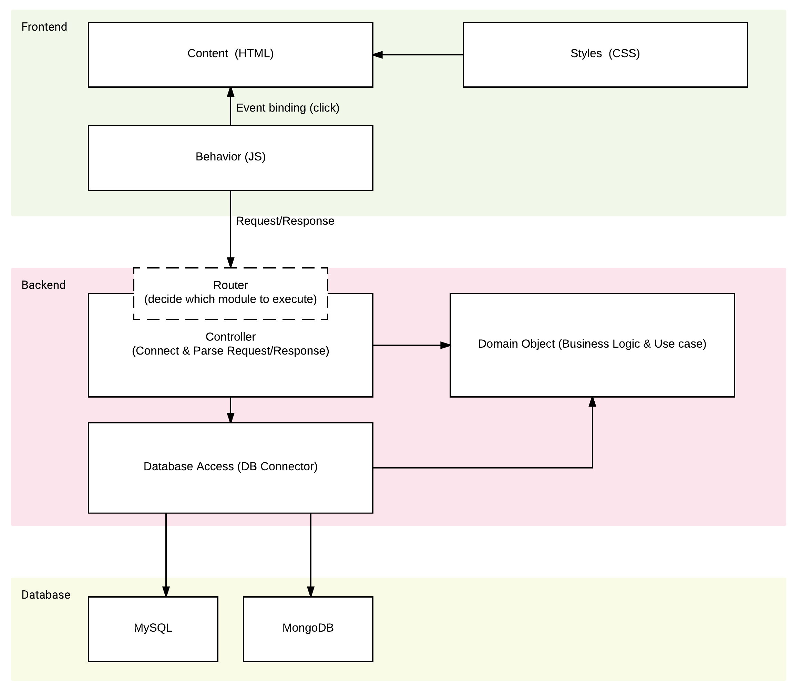
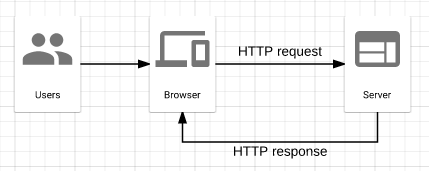
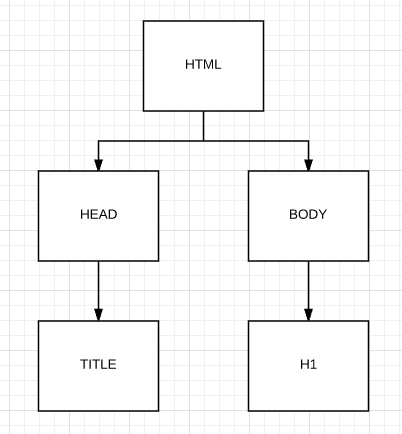

# Introduction

## Agenda

### Lecture

* Syllabus
* Overview
* Suggested development environment
* Basic HTML & CSS
* Basic Component (Button, Form, Table, Image)

> Detail HTML & CSS to come next week

### Lab

* Java set up
* Git/Github set up
* Development environment
* Student repository setup
* Deploy Components to Github page


## Syllabus

Go to [Syllabus.md](../SYLLABUS.md) for detail.

## Overview


Hello, Welcome to the web programming course.

We will be building a lot of fun web stuff together – specifically on an incremental
game, or so called project throughout entire semester.

What is an incremental game you ask?

Incremental game in a brief is a game where user click on a button to increment
a number. Most classic example is [cookie clicker](http://orteil.dashnet.org/cookieclicker/)
while the other one is the [universal peperclips](http://www.decisionproblem.com/paperclips/index2.html)

In this year, we will be building the game and the game framework to create
different theme of incremental game through content control from the backend.

### What is web application?

Web application exists everywhere nowadays. E.g. you are actually looking an
example of the web application right now while you are reading the lecture notes
(Github).

### Why is it important?

Web applications are easy to distribute to end users and it's considered to have
lower cost in development. And it's highly available to large amount of users
(as long as they have internet).

### What are we learning in this class?

We will be learning how to build server web applications from the front-end to
back-end and potentially to some server operations all in one class. By the end
of the class, I expect students to know how to build an application from the
start to the end.

However, this class isn't specialized in any of the fields. By the end of
this class, you may know enough of the everything to get started. If you wish,
you may explore more in any of the fields you would like. See [developer road map][1]
for checking out possible routes of being web developers.

### Overall web architecture

Before we start talking the technical details, lets take a step back to look at
overall big picture (architecture) for web applications.



At top level, we can split web applications into simplest three layers -- front-end,
back-end & database.

**Why these three matters?**

Most of time, you will run your web applications across different machines based
on these three layers. Front-end is usually running on the customers' environment
(whether a mobile phone, desktop, laptop or any other devices). Think of it as
an application that runs in the user browser (Chrome). Back-end, on the other hand,
is usually running on some sort of servers (whether it's on the cloud or some
machines). Since users cant interact with the server directly, this means you
have a lot more control on the server and allows you to do many different things,
including security access control and so on. The database server is usually 
separated from the back-end due to the fact you want data to be available 
regardless of the back-end server state. In example, there may be times you absolutely need
to restart your application server like deployment. If data is all stored in memory
on the back-end server, data will be **lost** when back-end server restarts.
Therefore, it is necessary to ensure the data lives in different server.

In short, these three are the simplest layers in web application architecture 
because they are usually running on different environment. Thus, they each serves
different purposes and are designed differently.

**Detailed components**

HTML represents the content on the screen while CSS address the presentation 
changes like styling. In example, you have have a `h1` tag with content like
`hello world`. But without the CSS, you will have a plain output displayed
in the browser. With CSS, you can make this `h1` tag to have a different color,
font-size or even position differently.

JavaScript on the other hand adds up the functionalities on top of HTML & CSS.
Consider example like a `button` in your page, button by itself when you click
it may not accomplish anything. However, with the code below:

```html
<button>Click me</button>
```

You may add JavaScript **on click** functionalities to do something like …
bring up a modal window to alert user.

```js
button.addEventListener('click', () => {
	alert('Hello there');
});
```

On the back end, you have router to determine which controller to call. In
example, you may have a router that takes URL like
`GET /api/v1/game/generators/meta` to call menu system.

And then on the menu controller you may start by doing validation first. After
validating request is valid, you can start sending the request to the database.

In the database access layer, you will be constructing SQL queries to create/update
data in the database.

Finally, in the database, you can store all the information safely.

### How the web works

How does the front-end application communicate to the server.
Fortunately, this communication has been standardized by HTTP (Hypertext Transfer
Protocol). You may check out [this wiki article](https://en.wikipedia.org/wiki/Hypertext_Transfer_Protocol) for more detail.



User may use browser like Chrome to **request** information from the
server and server **responses** with information based on the user request.

You may ask, how does server know what information user is requesting for?

One of the first information browser has to send is URL (Uniform Resource Locator)
to server. In fact, this URL may go through a lot of servers before it reaches to
designated server (e.g. go through DNS servers to find out which server to send).

For how DNS works, you can check out this comic -- https://howdns.works/ep1/

### URL

URL is spec'ed into several parts:

* protocol
* host name/IP
* path

Take this URL for example: https://github.com/csula/cs3220-sprint-2018

Protocol being `https` and host name being `github.com` while path being
`csula/cs3220-summer-2017`

Sometimes you may see port being included with the host name. e.g.

http://github.com:80/csula/cs3220-summer-2017

For most of time, you don't see port because the port 80 is the default port.
However, once a while (especially in your own development environment), you may
see port included in the URL.

### HTML

Stands for HyperText Markup Language.

```html
<html>
	<head>
		<title>CS 3220</title>
		<link rel="stylesheet" type="text/css" href="styles.css">
	</head>
	<body>
		<h1>Hello world!</h1>
	</body>
</html>
```

HTML is the most basic building block for the web. It's a language to describe
to browser what to display. Briefly speaking, it contains tag & attributes.

Tag being like `<html>` usually have its opening and closing tag `</html>`.

Attribute being like `rel="stylesheet"` usually within the opening part of the 
tag and it has its name and value (while value being surrounded by double quote).

### Summary of web

Again, web client like browser sends a request to a certain URL. Server receives
the URL and determine what information to return to client (simplest case will
be described in HTML so that browser can render information).

## Suggested Development Environment

Since majority of the class will be laboratory, I want to help everyone set up
their development environment as early as possible.

### Utilities

* [Git](https://git-scm.com/downloads)

> Please. Windows users, download Git and use the Git bash than windows command
line.

> Mac users, do `brew install git`

To test if Git is installed.

```
# rcliao @ Erics-MacBook-Pro in ~ [23:08:33]
$ git --version
git version 2.13.0
```

### Text Editor

* [VS Code](https://code.visualstudio.com/)
* [Sublime Text](https://www.sublimetext.com/)
* [Vim](http://www.vim.org/download.php)

### Java

https://github.com/csula/Utilities/blob/master/setups/java-gradle-setup.md

### Java IDE

* [IntelliJ](https://www.jetbrains.com/idea/)
* [Eclipse](https://eclipse.org/)


> Seriously though, use whatever IDE you want.

Test if Java is installed

```
# rcliao @ Erics-MacBook-Pro in ~ [23:10:54] C:1
$ java -version
java version "1.8.0_112"
Java(TM) SE Runtime Environment (build 1.8.0_112-b16)
Java HotSpot(TM) 64-Bit Server VM (build 25.112-b16, mixed mode)
```

## Basic HTML & CSS

### DOM

DOM stands for document object model. DOM is a programming interface for HTML
and XML. DOM provides structured representation of the document in browser as
well as many functionalities for developers (e.g. change content & style).

We will cover more of what DOM can do when we dive into JavaScript section.

Meanwhile, you may read this document to get a head start …
https://developer.mozilla.org/en-US/docs/Web/API/Document_Object_Model/Introduction

### DOM Tree

In browser, DOM formulates a tree structure starting as the `document` as the 
root and head and body as the first child. See example below:

```html
<html>
	<head>
		<title>Test</title>
	</head>
	<body>
		<h1>Hello world!</h1>
	</body>
</html>
```



### Selector

Selectors allows developers to locate DOM within the DOM tree. In example, if
we want to find the `h1` element in the DOM tree above, we may do the selector
below:

```html
html > body > h1 {
	color: red;
}
```

We will cover more on the selectors when we start the html & CSS section next week

## Basic Components

### Button

**html**

```html
<button>This is a button</button>
```

**css**

```css
button {
	background-color: #333;
	color: #fff;
	padding: 0.5em 1em;
}
```

### Form

**html**

```html
<label for="name">Name</label>
<input id="name" type="text" />

<label for="age"></label>
<input id="age" type="number" />
```

**css**

```css
label {
	font-size: 0.8em;
	font-color: #333;
}

input {
	font-size: 16px;
	padding: 0.5em 1em;
}
```

### Table

**html**

```html
<table>
	<thead>
		<tr>
			<th>Name</th>
			<th>Price</th>
		</tr>
	</thead>
	<tbody>
		<tr>
			<td>Hambuger</td>
			<td>$15.99</td>
		</tr>
	</tbody>
</table>
```

### Multimedia (image)

```html

```

## Exercise (practice lab)

In the remain section, we will practice with the HTML and CSS we did earlier
and push changes to Github pages.

Please click on this link to create your student repository:

https://classroom.github.com/a/ar3pUKJo

And here is the exercise 1 link:

[Exercise 1](exercises/exercise.md)

[1]:https://github.com/kamranahmedse/developer-roadmap
[2]:https://en.wikipedia.org/wiki/Hypertext_Transfer_Protocol
