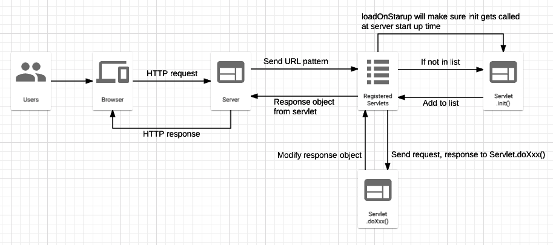
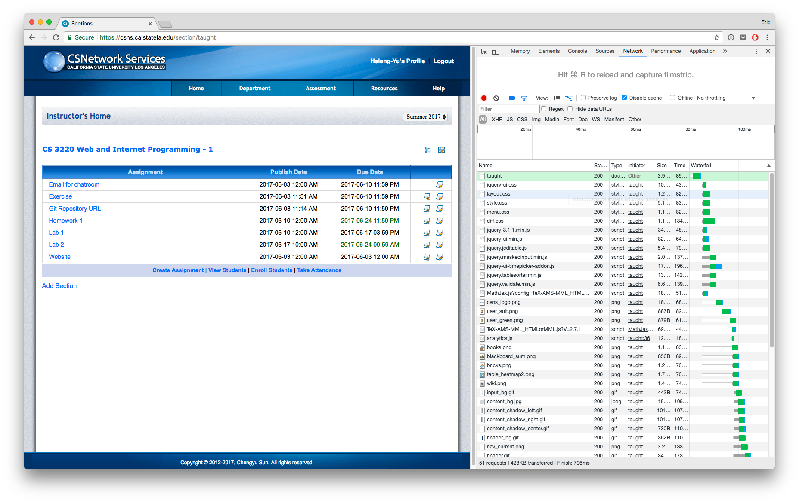
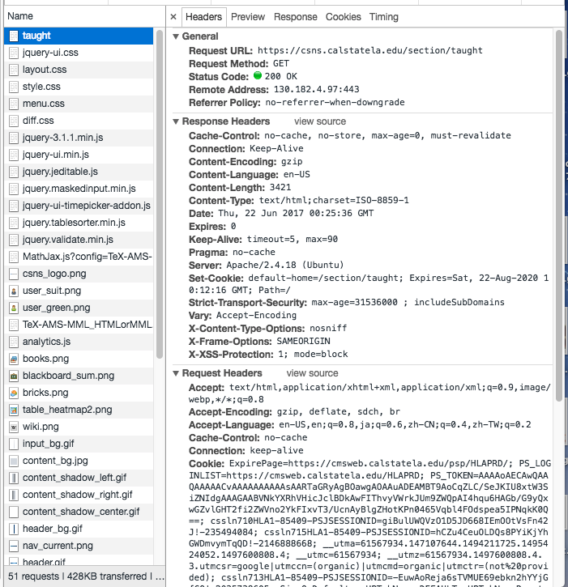
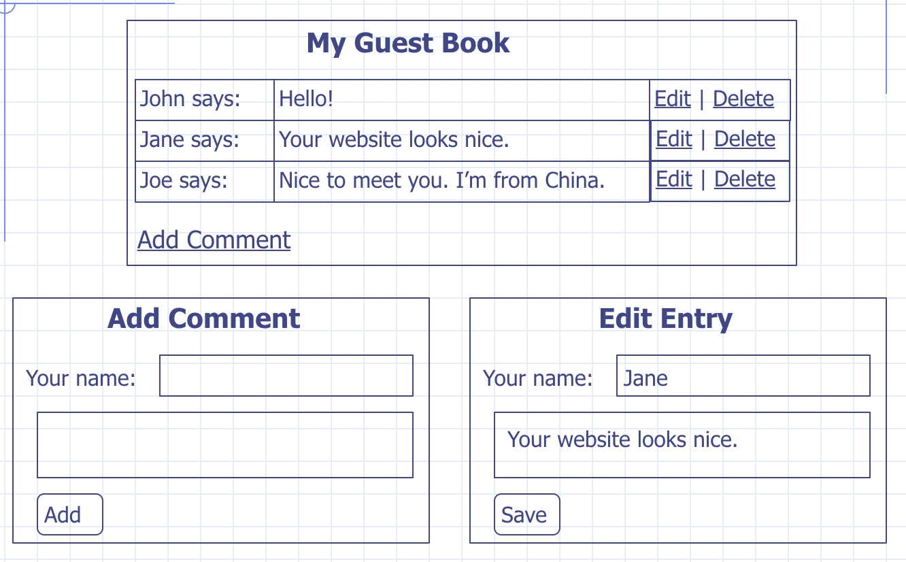
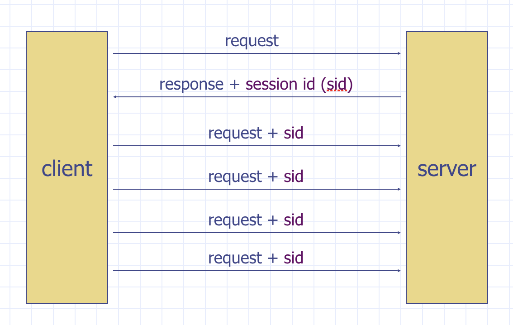
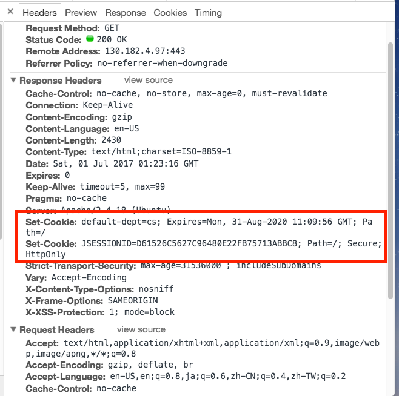
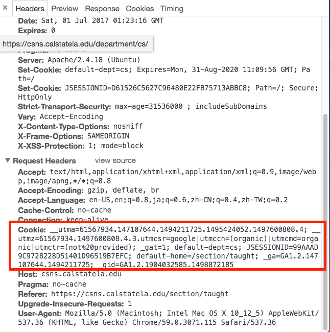
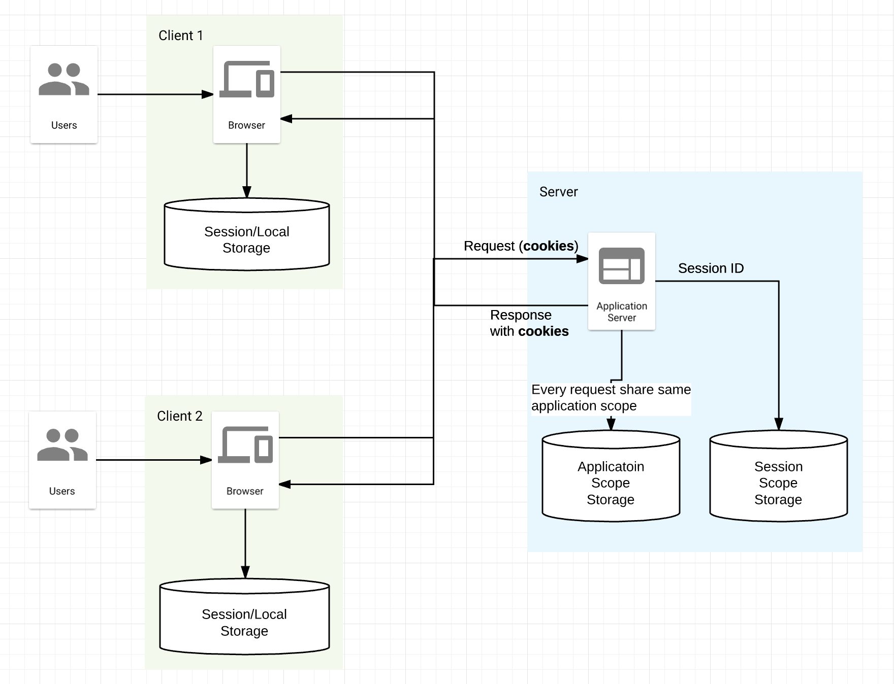

# Java Servlet & Tomcat

## Agenda

### Lecture

* [Servlet](#servlet)
* [Client/server](#client-server)
* [Cookies and Session](#cookies-session)

### Lab

* Java environment setup
* Tomcat server setup
* Implement basic server behavior for restaurants

## Servlet

### Prerequisites

* Install Java
* Download tomcat http://tomcat.apache.org/
* Download JSTL https://csns.calstatela.edu/download.html?fileId=3812279
* Download JDBC Driver https://dev.mysql.com/downloads/connector/j/

### Tomcat Set Up

https://github.com/csula/Utilities/blob/master/setups/java-tomcat.md

### Java Web Application Components

* Compiled Java Classes (.class files)
* Additional Java Libraries (.jar files)
* JavaServer Pages (JSPs)
* Static resources
	* HTML, CSS, images, JavaScripts ... etc.
* Meta data files
	* web.xml

Files structures on CS3 Server

```
/                        --> www folder
index.jsp                --> JSPs and static assets
other.jsp
WEB-INF/
  web.xml
  classes/               --> Compiled Java classes
  lib/                   --> Additional Java libraries
```

### Servlet Hello World

```java
import java.io.*;
import javax.servlet.*;
import javax.servlet.http.*;

@WebServlet("/HelloWorld")
public class HelloWorld extends HttpServlet {
	public void doGet( HttpServletRequest request, HttpServletResponse response)
		throws ServletException, IOException {
		PrintWriter out = response.getWriter();
		out.println("Hello World");
	}
}
```

* Inherits from [HttpServlet](http://docs.oracle.com/javaee/7/api/javax/servlet/http/HttpServlet.html)
* doGet()
	* Input: HttpServletRequest
	* Output: HttpServletResponse => sent back to browser

### Output HTML from Hello World Servlet

* Set content type to "text/html"
	* setContentType(String type)
* Generate an HTML page
	* getWriter().println(String output)

### Servlet mapping (routing)

```
@WebServlet(<URL Pattern(s)>)
```

### Java Annotations

Annotations is about a program that is not part of program itself and can be used
by compiler, VM and other software tools for various purposes

Examples:

```java
// for error detection
@Override
protected void doGet() {} 

// Suppress warning
@SuppressWarnings("unchecked")
public List<User> getAllUsers() {
	return (List<User>) new ArrayList();
}

// Servlet mapping
@WebServlet("/HelloServlet")
public class HelloServlet extends HttpServlet { }
```

### WebServlet elements for URL patterns

* value of the WebServlet annotation is the URL patterns of the Servlet

```java
@WebServlet("/HelloServlet")

@WebServlet({"/HelloServlet", "/members/*"}

@WebServlet( name="Hello", urlPatterns={"/HelloServlet", "/*.html"} )

@WebServlet(
	urlPatterns="/MyPattern",
	initParams={@WebInitParam(name="ccc", value="333")}
)
```

Notice that you can use wild card `*` in the Servlet mapping. e.g.

```
/*
/content/*
*.html
```

> Please be careful with the URL patterns because you might have conflicting patterns

### Servlet Life Cycle


* When servlet is loaded -- `init()`
	* Executed only once
	* Don't forget to call `super.init(config)`
* Per request - `service()`
	* Dispatch to `doXxx()` e.g. `doGet()`
When servlet is unloaded -- `destroy()`

**Why use `init()` instread of constructor**

https://csns.calstatela.edu/wiki/content/cysun/notes/servlet_data_init

Also, ServletContext cannot be access in constructor

### Servlet example - SharedRequestCounter

```java
import java.io.*;
import javax.servlet.*;
import javax.servlet.http.*;

@WebServlet("/HelloWorld")
public class HelloWorld extends HttpServlet {
	public void doGet( HttpServletRequest request, HttpServletResponse response)
		throws ServletException, IOException {
		PrintWriter out = response.getWriter();
		out.println("Hello World");
	}
}
```

### Application Scope

* A "storage area" where data can be stored and accessed
* Data in application scope will remain there as long as application is running
* Data in application scope is shared by all servlets

To access application scope:

* HttpServlet - `getServletContext()`
* HttpServletContext
	* setAttribute(String name, Object value)
	* getAttribute(String name)

### loadOnStartup

By default, a servlet is not created until it is accessed for the first time 
(lazy loading)
	* Could cause problem if one servlet must be run before another servlet

By using `loadOnStartup` element of `@WebServlet` to have servlet created during
application startup

```java
@WevServlet(
	name="Hello",
	urlPatterns={"/HelloServlet", "/*.html"},
	loadOnStartup=1
)
```

### web.xml

Web application deployment descriptor. In example:

```xml
<web-app>
	version
</web-app>
```

### Debugging Servlets

* 404 errors: check URL and URL mapping
* Display problem: check the source of generated HTML
* Logical errors: Use debugger to set break points

## Client Server



The primary client we will be dealing with in this class is the Browser. Browser
will initialite a request against your tomcat server. Tomcat server then
determines which Servlet is responsible for this URL pattern (using WebServlet
annotation above or defined in the web.xml file). Once determines, Tomcat then
will either call `init()` method in the Servlet if this Servlet is not yet loaded
before. Once the Servlet is loaded, it will trigger Servlet `doXxx()` method.
E.g. it will call `doGet()` if the method is a GET request.




From the browser end you can use the Chrome developer tools shown as above to see
what request Browser is sending and response is getting from server.

A couple things you want to check here is:

* Request header
	* Request URL
	* Request method

Everything else is situational. In example, sometimes you may want to check with
`accept` to see if what type of response client is expecting. Sometimes, client
may not even expect an HTML response.

### Request methods

There are a few common request methods you will need to know:

* GET
* POST
* PUT
* DELETE

**GET request**

GET request is the most common request method you will see in web development.
When browser opens a page, by default browser is sending a GET request to your
server.

GET request means that the client is retrieving for some information under the
URL pattern.

**POST request**

POST request is the second most common request method. It is usually used when
client want to create/update certain information in your server with updated
information within the request body.

You can send POST request using `form` element in the browser that is taught
earlier in the HTML & CSS section. As example:

```html
<form action="/create-food" method="post">
	<input type="text" name="name">
	<input type="text" name="imageUrl">
	<input type="text" name="description">
	<button type="Submit">Submit</button>
</form>
```

**PUT request**

PUT request is very similar to POST request in a way that it's used for **updating**
information but only for updating. Commonly, developers just use POST request for
every update/insert. In browser spec, it's more recommended to use PUT request
however.

Anyway, to get the above form to send PUT request, you only need to change
`method` attribute to "PUT" like below:


```
<form action="/update-food" method="put"></form>
	<!-- rest of the form can stay the same -->
</form>
```

**DELETE request**

As what it sounds, it's used to indicate that client want to delete certain resource
from the server.

### HttpServlet methods

Remember what you did earlier on the HelloWorld servlet? `doGet()` to handle
GET request?

Similar pattern can be applied to other methods too!

```
Request method -> HttpServlet method name
-----------------------------------------
GET            -> doGet()
POST           -> doPost()
PUT            -> doPut()
DELETE         -> doDelete()
```

### Request parameters

In additional to the request header, client has few other ways to include more
information of the request:

* Query string
	* ?param1=value1&param2=value2&...
* Form data

### Practice: addition

Get two integers from the request query parameter and display the sum.

In specific, user should be able to open up the browser and type in
http://localhost:8080/sum?num1=2&num2=6 and see result of "8" showing up in the
browser.

Hint:

* https://tomcat.apache.org/tomcat-5.5-doc/servletapi/javax/servlet/ServletRequest.html#getParameter(java.lang.String)

### HTML Forms

In form element, you can specify the request sending to server. As example:


```html
<form action="/create-food" method="post">
</form>
```

**action** attribute

It indicates the URL of the server side program that process the submitted form
data

**method** attribute

Indicates what type of request form is sending

### Practice: Guest book

Create a guest book example as below:



#### Web application definition

To recall what a **web application** is:

Web application is data plus operations.

Data can be:

* Guestbook entries, forum posts, products, customers, transactions ... etc.

Operations can be:

* add/create, search, display, edit, delete ... etc.

#### Guestbook implementation:

Data:

* GuestBookEntry
* List<GuestBookEntry>

Operations:

* Display
* Add
* Edit
* Delete

#### Guestbook - display

* Initialize data storage in application scope
* Pre-create some data
* Generate HTML

#### Guestbook - add

* Handling web forms usually involves two operations
	* doGet() -> display form
	* doPost() -> process the form submission
* response.sendRedirect() -> to redirect after processing

#### Guestbook - edit

* Embed an identifier of the data to be edited in generated hyperlink or form (
using hidden form field)

#### Guestbook - delete

* Use an unique and immutable identifier instead of array index

### Generating Responses

You will notice we put HTML directly into the **response body**. There many more
things you can do with HTTP response:

* Response status
* Modifying response header
* Response body

#### General status code:

1\*\*, Hold on
2\*\*, Here you go
3\*\*, Go away
4\*\*, You f\*\*\*ed up
5\*\*, I f\*\*\*ed up

In example, by default without specifying, Java will return Http Status code 200 (OK).

There are also common ones like below:

* 401 (Unauthorized)
* 403 (Forbidden)
* 404 (Not found)
* 500 (Internal Server Error)

#### Why is response code useful?

Sometimes when you are communicating to the server, your request may need to go
through a series of validation process. Lets simplify the general process into:

* Parse request
* Validate request params
* Transaction
* Modifying response

You can return 200 by the end if everything goes alright. But if there is something
wrong, you will need to tell your client on what is wrong. Http status code is
extremely useful for this purpose. For instance, you can say the request is not
validated by http status code 400 (bad request) with explanation in the response
body.

#### About redirects

* 301 (Move permanently)
* 302 (Move temporarily)
* 303 (See other)
* 307 (temporary redirect)

> Please note that the big difference between 301 and 302 is -- 301 will be cached
by browser forever.

Redirects usually goes with another header `Location` to indicate where the page
is redirected to.

#### Error pages in web.xml

In additional to define the routing table, web.xml can also tell tomcat to display
special error page based on the http status code.

In example:

```xml
<error-page>
    <error-code>404</error-code>
    <location>/WEB-INF/404.html</location>
</error-page>

<error-page>
    <error-code>403</error-code>
    <location>/WEB-INF/403.html</location>
</error-page>
```

#### Header fields

* Request
	* Accept
	* Accept-Charset
	* Accept-Encoding
	* Accept-Language
	* Connection
	* Content-Length
	* Cookies
* Response
	* Content-Type
	* Content-Encoding
	* Content-Language
	* Connection
	* Content-Length
	* Set-Cookie

#### HttpServletResponse

http://download.oracle.com/javaee/7/api/javax/servlet/http/HttpServletResponse.html

Methods

* addHeader(), setHeader()
* containsHeader()
* setContentType(String type)
* sendRedirect(String location)
* getWriter()
	* For text response, e.g. HTML page
* getOutputStream()
	* For binary responses, e.g. images

#### Example Add revisited

* Redirect the user back to the input form if the parameters are missing or invalid
	* `sendRedirect()` method doesn't terminate the method

## Cookies Session


You will see many notifications like above in regards of *Cookies* when you go
to site for the first time.

### What are this mysterious cookies?


> No, not you. Not the actual cookie.

> An HTTP cookie (also called web cookie, Internet cookie, browser cookie, or simply cookie)
is a small piece of data sent from a website and stored on the user's computer
by the user's web browser while the user is browsing.

Reference: https://en.wikipedia.org/wiki/HTTP_cookie

Basically, a set of data you can store based on the user request and hook it up
to their browser.

### Why do we need cookies?

You might want to store personal related data on cookies. In example, their login
status, personalization, shopping carts.

### Challenge of session tracking

The challenge to store such data in the application scope or database is you don't
know which user/session it is coming from because HTTP by default is a "stateless"
protocol. This means, from request to request, you have no way to tell which client
it is sending from.

So how do we tell this request is from user 1 but not user 2?

We can have server to insert a "session id" on each request and response.



There are generally three way to implement session tracking:

* URL Re-write
	* e.g. http://csns.calstatela.edu/index.html;jsessionid=748D9512C9B19B0DCC9477696A88CF12
* Hidden form fields
	* `<input type="hidden" name="sessionid" value="12345" />"`
* Cookies

### Cookies

Cookies is set by the web server as a response header `Set-Cookie`



And then in each of subsequent request followed by browser as request header `Cookie`



### Cookie Attributes

From here, you can think of cookie similar to the "application scope" we have done
earlier. Or think of it as a small storage you can store a key-value pair per site
per session.

It has the following attributes that is interesting:

* Name, value (key-value pair)
* Host/Domain, Path
	* Control whether cookie should be included in the request
* Require secure connection
* Max age
* Comment

You can see the cookie attributes from the API: http://docs.oracle.com/javaee/6/api/javax/servlet/http/Cookie.html

In example, you can add cookie using `addCookie( cookie )` and get cookies by `getCookies()`
from the HttpServletResponse.

#### Example: Guestbook with cookies

* Use a cookie to store name so a user only needs to enter their name once.

### Concerns about cookies

* Is cookie potentially a security concern?
* What about privacy?

### Known problems with cookies

* Cookies have size limit
* Malicious user can fake cookie (as they are coming from the request header)
* Sometimes cookie is disabled in browser (which is why you see the notification all the time)
* Cookie API is somewhat tedious to use

### Servlet Session Tracking API

* [HttpServletRequest#getSession](http://docs.oracle.com/javaee/6/api/javax/servlet/http/HttpServletRequest.html#getSession())
* HttpSession: http://download.oracle.com/javaee/6/api/javax/servlet/http/HttpSession.html
	* getAttribute( String )
	* setAttribute( String, Object )
	* invalidate()

* Data is stored on the server, e.g. no size limit
* Each session is assigned to a unique session id, which is used to access data
associated with the session
* Session id is randomly generated and hard to fake
* Session tracking use cookie by default, but it can automatically switch to URL rewriting if cookie is disabled

#### Example: Guestboook with session tracking API

* Session is shared among servlets
	* Servlet context attributes (application scope) vs session attribute (session scope)
		* Similarities??
		* Differences??
		* Usage??

### Session configuration in web.xml

* Default session timeout in Tomcat is 30 minutes
* Session timeout can be changed in web.xml
	* The timeout value must be an integer
	* Session never timeout if value <= 0

```xml
<session-config>
    <session-timeout>60</session-timeout>
</session-config>
```

### Recap on storage

We have learned many storage types so far. Lets use graph to explain them:



