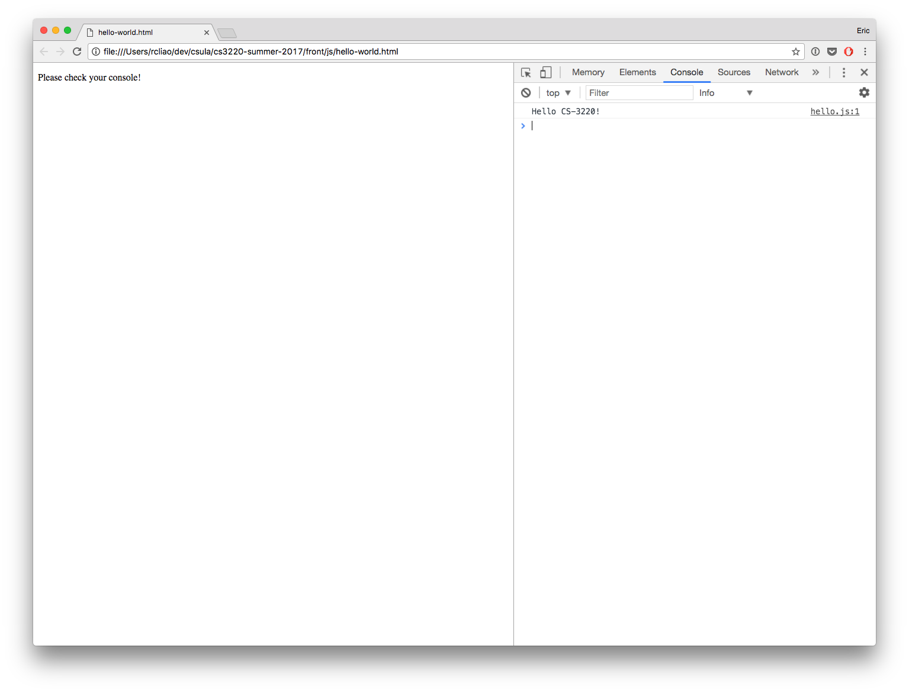

# JavaScript

## Agenda

### Lecture

* [JavaScript Intro](#javascript-intro)
* [JavaScript syntax](#javascript-syntax)
* [EcmaScript 6 features](#es6-features)
* [Common JavaScript Usage](#common-javascript-usage)
    * Query for DOM element
	* Add event listener
	* Class toggle
* [Component pattern](#component-pattern)

* [Callback](#callback)
* [Browser storage](#browser-storage)
* [You may not need jQuery](#you-may-not-need-jquery)

### Lab

* Button to counter
* Generator to inventory

### Homework

* Background game loop

## JavaScript Intro

JavaScript ("JS" for short) is a dynamic type language that is commonly used in
the front end development world. JS is also being used as a backend choice 
nowadays due to the raise of [Node.js](https://nodejs.org/en/) community.

In this lecture, we will learn JS in the context of browser and not Node.js
development. In browser, you can use JS to do many different things. These
includes creating carousel, button click event, changing layout. More
advance usage includes creating browser games, animated 2D and 3D graphics.

Many people start learning JavaScript by using one of the third party libraries
or start by using JavaScript API in browser. Since this lecture is supposed to
be introduction to JavaScript, we will not confuse you by starting using API
nor libraries but learning plain JavaScript.

In other word, we will start by learning JavaScript syntax, data structure &
common pattern like callback. After learning the basic, we will have a short
exercise to test your JavaScript knowledge before we move onto the EcmaScript 6
features (e.g. arrow function, Promise … etc.).

### Hello world

JavaScript as one of the most common yet powerful language is probably easier
to learn by doing than all the theories around it. To run the hello world example:

```html
<p>Please check your console!</p>
<script>
    console.log('Hello world!');
</script>
```

You should be able to see something like screenshot below:



Please modify the script content to be like below to see how to use Browser
API to change HTML content:

```javascript
document.querySelector('p')
	.textContent = 'Hello JavaScript from CS-3220';
```

You should notice the message changes from "Please check your console!" to
"Hello JavaScript from CS-3220".

What happened?

We change the HTML content by first using [querySelector()](https://developer.mozilla.org/en-US/docs/Web/API/Document/querySelector) API to find out
the right HTML node.

> You should notice the querySelector API selector is similar to CSS
selector we learned from last class.

After that, we change the [textContent](https://developer.mozilla.org/en-US/docs/Web/API/Node/textContent) of the HTML node.

## JavaScript Syntax

### Variables

JavaScript is a *dynamic type language*; thus, to declare a variable, you don't
have to declare the type of it and simply put "var" for declaring a variable.

```javascript
// in JavaScript empty value of a variable is "undefined"
var newVariable;
```

> Although semicolon is optional, I highly recommend you to put semicolon on the
end of every statement!

Now lets put some value in the variable!

```javascript
// to assign variable, it is the same statement as Java using "="
newVariable = 'Hello CS3220';

// you can also combine declaration with assignment together if you want!
var newVariable2 = 'Hello CS-3220';

// and then to retrieve variable simply call variable
newVariable;

// After you declare and assign variable, you can always assign the variable again
newVariable = 'Hello cs-3220 again';
```

Now we know how to declare and assign variable, lets learn the basic types in
JavaScript:

* String
* Number
* Boolean
* Array
* Object

```javascript
var stringVariable = 'This is a string';
var numberVariable = 123;
var booleanVariable = true;
var array = [ 1, 2, 3 ];
var jsObject = {
	name: 'value',
	number: 123,
	array: [1234, 5678]
};
// as well as everything is an object in JavaScript
var h1 = document.querySelector('h1'); // is also an object
```

### Operators

* Add/concatenation

```javascript
6 + 4;
'A string' + 'another string';
```

* subtract, multiply, divide

```javascript
3 - 2;
2 * 3;
4 / 2;
```

* Identity operator

```javascript
1 === 1;
```

* Negative, not equals

```javascript
var t = true;
f = !t;

f !== t; // true
```

### Conditions

```javascript
if (1 === 2) {
	console.log('What!?!?!?!?');
} else {
	console.log('1 is not equal to 2');
}
```

You will notice in JavaScript, you are using "===" than "==" like other language.
You can also do "==" in JavaScript but it's not recommended for most of time.
"==" is the loose comparison. In example, the following will return true:

```javascript
1 == '1';
true == 'true';
null == undefined;
```

In other word, "==" will do the object conversion automatically. For most of the
case, this conversion behavior is not ideal for the condition. Therefore, it is
more recommended to do "===" than "==".

### Loop

In JavaScript, you can use the following to loop through items:

```javascript
var list = [1, 2, 3];

for (var i = 0; i < list.length; i ++) {
    console.log(list[i]);
}

// or use forEach function from Array
list.forEach(function(item) {
    console.log(item);
});
```

### Functions

To declare a function in JavaScript, you simply use `function` keyword:

```javascript
// to delcare a function
function aFunction () {
	console.log('Calling a function');
}

// or you can declare function in usual assignment way
var anotherFunction = function () {
	console.log('Calling another function');
}

// to call a function, simply call the function name with "()"
aFunction();
anotherFunction();

// function can have arguments
function multiply (a, b) {
	return a * b;
}

multiply(2, 3); // return 6
```

### Array functions

It's common to do operations on array. In JavaScript, there are some built-in
array functions you may find familiar coming from functional programming background:

```javascript
var list = [1, 2, 3];

// classic forEach, map, reduce, & filter functions
// forEach can replace the usage of traditional for loop
list.forEach(function(item) {
    console.log(item);
});

// map is useful when you want to transform every item in array
list.map(function(item) {
    return item * 2;
}).forEach(function(item) {
    console.log(item); // should log out 2, 4, 6
});

// reduce is useful when you want to combine array into a single item
list.reduce(function(accu, item) {
    return accu + item;
}, 0); // should return 6 because (1 + 2 + 3)

// filter is useful when you want only certain items from array
list.filter(function(item) {
    return item > 1;
}).forEach(function(item) {
    console.log(item); // should only print 2, 3
});
```

### Events

One of the most important aspect of the JavaScript is **events**. To add a click
listener, you will need a event. To add a submit listener, you will need a event.

Events are used for JavaScript to listen for certain things happening in browser.
The most obvious one is "click" event like below:

```html
<button id="click_me">button</button>
```

```javascript
document.querySelector('#click_me').onclick = function () {
	alert('Hello there');
};
document.querySelector('#click_me').addEventListener('click', function() {
	alert('Hello there again');
});
```

Reference: https://developer.mozilla.org/en-US/docs/Web/Events

**Practice**

From here, lets do a practice on having a color square that changes its color
on click.

```html
<span class="rgb-square"></span>

<style>
	.rgb-square {
		display: block;
		background-color: #fff;
		width: 2em;
		height: 2em;
	}

	.rgb-square.--red {
		background-color: red;
	}
	.rgb-square.--blue {
		background-color: blue;
	}
	.rgb-square.--green {
		background-color: green;
	}
</style>
```

```javascript
var dom = document.querySelector('.rgb-square');

dom.addEventListener('click', function () {
	// fill in the logic to change color of the square
	// hint: you can use https://developer.mozilla.org/en-US/docs/Web/API/Element/classList to change color
});
```

**Practice #2**

Lets do another practice on getting inputs from the browser. Lets say we want to
play a guessing game!

```html
<p>Hi there, I want to play a guessing game with you! Please guess a number
between 1 and 10; and I will tell you if it is my number or not!</p>
<button id="guess">Guess a number</button>
```

```javascript
var node = document.querySelector('#guess').addEventListener('click', function() {
	var number = prompt('Guess a number!');
});
```

## ES6 features

Modern JavaScript programming actually contain a lot of syntactic sugar, these
includes:

* Arrow function
* Classes
* Template string
* Default & Rest + Spread
* Let + const
* Module
* Promise

### Arrow functions

Arrow functions are essentially the same as the Java lambda function like below:

```javascript
function a () {
    console.log('a');
}

b = () => {
    console.log('same as a');
}

// You can use the arrow function to replace the usual function declaration
var list = [1, 2, 3];
console.log(list.map(i => i * 2));

var list2 = ['Hello', 'World'];
list2.forEach((item, index) => {
    console.log(item, index);
});
```

https://developer.mozilla.org/en/docs/Web/JavaScript/Reference/Functions/Arrow_functions

### Classes

Classes declaration is interesting since it brought our favorite Object Oriented
thinking into JavaScript. Pre-ES6, you will need to do prototype inheritance.
Now with the classes declaration, you can define object and inherit pretty well!

```javascript
class Shape {
    get area() {
        console.log('Define me!');
    }
}

class Square extends Shape {
    constructor(length) {
        super();
        this.length = length;
    }

    get area() {
        return this.length * this.length;
    }
}

var sq1 = new Square(5);
sq1.area;
```

https://developer.mozilla.org/en-US/docs/Web/JavaScript/Reference/Classes

### Template string

Template string is like Java String.format method allowing you to define String
with variables inside.

```javascript
var test = 'Hello';
var tplString = `${test} World!`;
```

### Default, rest & spread

Default allows function argument to have default value if it is not assigned.

```javascript
function defaultValueFn (a = 'hello', b = 'world') {
    console.log(a, b);
}

defaultValueFn('Hey');
```

Rest allows function to declare argument as list

```javascript
function restValueFn (a, ...b) {
    console.log(a, b.length);
}

restValueFn('test', 'hello', '1', '2');
```

Spread allow argument to accept array as many arguments to function.

```javascript
function spreadFn (a, b, c) {
    console.log(a, b, c);
}

spreadFn(...[1, 2, 3]);
```

### Let & Const

Let is a scoped variable and will never be exposed outside of function scope.
Const is like a `final` keyword in Java -- declare a variable that cannot be
reassigned.

```javascript
function blockFn () {
    let a = 3;
    const b = 'cannot be reassigned';
    b = 'test'; // error because b cannot be reassigned
    let a = 4; // error because a is already declared
}
```

### Module

Module allows JS developer to define reusable module so other JS external files
can import and reuse.

```javascript
// math.js
export function multiply (a, b) {
    return a * b;
}
```

```javascript
import {multiply} from 'math';
console.log(multiply(2, 3));
```

### Caveat of ES6

ES6 is amazing step for the JavaScript as a programming language. Although ES6
is amazing, you have to be aware that not all browser supports all functions for
ES6 yet (looking at IE).

Check http://caniuse.com website for the browser support:

http://caniuse.com/#search=es6

For the context of this class, feel free to use ES6 for homework and assignment;
you can just assume end user (me) will only be using Chrome.

For the production usage, you will need to learn how to use pre-builder to compile
ES6 code down to ES5 compatible. A good starting point would be looking at BabelJS.

Reference: https://babeljs.io/

## You may not need jQuery

With above ES6 features, it's almost a guarantee that you don't need to use
jQuery for any reason. You can check out the following website on common front
end functionalities.

http://youmightnotneedjquery.com/

My take on jQuery is -- don't ever use it for your code. It's not a browser
standard and it only simply your code by a few lines but nothing else. To use
jQuery, your application code becomes way heavier than necessary (adding a few
hundred kb size to your bundle).

## Common JavaScript usage

That should be enough to get you started with JavaScript. Lets talk about some
of the most common operations with JavaScript in browser:

* Query for DOM element
* Adding event listener
* Toggle class

### Query for DOM element

Using `querySelector` and `querySelectorAll`, JavaScript developers are able to
find the exact DOM node(s) from document. In example:

```javascript
// find an element with id of "special"
const specialNode = document.querySelector('#special');
// find all elements with class of "btn"
const buttonWithBtnClass = document.querySelectorAll('.btn');
// find all elements with tag of "button"
const buttons = document.querySelectorAll('button');
```

> You will notice the query selector syntax is extremely close to the CSS selector.
Please be familiar with CSS selector before using querySelector

### Add event listener

Adding event listener is probably by far the most common operation in JavaScript.
For example, if you want to react to a button click you can go with following:

```javascript
const btn = document.querySelector('#some_button');
btn.addEventListener('click', () => {
    alert('This event is responding to your button click');
});
```

### Class toggle

Coming after reacting to adding event listener, toggling classes is second most
common operation.

```javascript
function toggleBtnClass () {
    const btn = document.querySelector('#btn')
    btn.addEventListener('click', () => {
        btn.classList.toggle('--state-success');
    });
}
```

Then, the remaining JavaScript logics all lives with your business logic (e.g.
validation rules).

## Component Pattern

Component based architecture is damn common in many modern JavaScript frameworks
nowadays. This is true for Angular(JS), React, Vue, Ember and so on.

In this lesson, we will not be using any of the frameworks to create component however.

To focus our learning on JavaScript, we will be creating our own component
in lower level fundamental as concept to students. In specific, we choose to use
[WebComponent](https://developers.google.com/web/fundamentals/web-components) to
implement while the popular framework like Angular or React may have slightly
different specification.

### What is a component?

Component has many different definition. We can start by a more common definition
like below:

> An individual software component is a software package, a web service, a 
web resource, or a module that encapsulates a set of related functions (or data).

In the User Interface (UI) world, instead of looking at the individual control (like button,
input tag). We combine the related functionalities together to form an UI
component.

Furthermore, an UI component is a small, potentially re-usable set of logic,
interface and behavior elements.

### Example component

In the following example, we will start by plain old JavaScript component first.
And we will create the same component in WebComponent Spec by extending from
custom element.

#### Plain Old JavaScript

```javascript
class RGBSqaure {
    /**
     * Pass the dom element into the JavaScript class to attach event & data
     */
    constructor(root) {
        this.root = root;
        this.colors = ['r', 'g', 'b'];
        this.colorIndex = -1; // no color
        this.onClick = () => this._updateColor();
        this.init();
    }

    // define its life cycle with init
    init () {
        this.root.addEventListener('click', this.onClick);
    }

    // on destroy, it should remove all the event listeners so it doesn't create
    // memory leak
    destroy () {
        this.root.removeEventListener('click', this.onClick);
    }

    _updateColor () {
        let oldClass = this.colorClass(this.colorIndex);
        let newClass = this.colorClass(++this.colorIndex);
        if (oldClass) {
            this.root.classList.remove(oldClass);
        }
        this.root.classList.add(newClass);
    }

    colorClass (i) {
        if (i < 0) {
            return '';
        }
        return this.colors[i];
    }
}
```

#### WebComponent

```javascript
class RGBSquare extends window.HTMLElement {
    constructor () {
        // this is the "DOM" of what is created, e.g. <rgb-square>
        this.colors = ['r', 'g', 'b'];
        this.colorIndex = -1; // no color
        // use closure to create consistent function reference
        this.onClickEvent = () => this._updateColor();
    }

    connectedCallback () {
        this.root.addEventListener('click', this.onClick);
    }

    disconnectedCallback () {
        this.root.removeEventListener('click', this.onClick);
    }

    // Same methods as above
    _updateColor () {
        const oldClass = this.colorClass(this.colorIndex);
        const newClass = this.colorClass(++this.colorIndex);
        if (oldClass) {
            this.classList.remove(oldClass);
        }
        this.classList.add(newClass);
    }

    colorClass (i) {
        if (i < 0) {
            return '';
        }
        return this.colors[i];
    }
}
```

Before we move onto detail, you might be thinking why go such long route for 
defining this extra class? Everything can be done without the component class
and just do the querySelector, click-event binding and classList.

In specific:

```javascript
const squrares = document.querySelectorAll('.rbq-square');
squares.forEach(square => {
    square.colors = ['r', 'g', 'b'];
    square.addEventListener('click', () => {
    });
});
```

The problem of that approach is – it tends to create spaghetti code. And it's
a nightmare to maintain such code! Therefore, it is necessary for our sanity
to follow some sort of pattern so our code becomes easier to maintain and refactor.

Also, you create a reusable piece of code by limiting the logic to be done following
the component. In example, to re-use this color square, you only need to apply
the same component somewhere else rather than *copying and pasting*.

### What if JavaScript need to do render?

To render an HTML string from JavaScript, you can simply use the `innerHTML`
attribute in the DOM. In example:

```javascript
class RandomList {
    constructor(root) {
        this.root = root;
        this.list = [];
        this.fillRandomValues();
        this.init();
    }

    init () {
        // using innerHTML with template string, you achieve a simple template
        // rendering
        this.root.innerHTML = `<ul>
            ${this.getListItems()}
        </ul>`
    }

    getListItems () {
        return this.list.map(item => {
            return `<li>${item}</li>`;
        }).reduce((a, b) => {
            return a + b;
        }, '');
    }

    fillRandomValues () {
        let size = this.randomNum();
        for (var i = 0; i < size; i ++) {
            this.list.push(this.randomNum());
        }
    }

    randomNum () {
        return Math.floor(Math.random() * 100);
    }
}
```

## Resources

* [What the heck is JavaScript event loop anyway?](https://www.youtube.com/watch?v=8aGhZQkoFbQ)
* [Learn JavaScript in one video](https://www.youtube.com/watch?v=fju9ii8YsGs)
* [Eloquent JavaScript book](http://eloquentjavascript.net/)
* [You don't know JS](https://github.com/getify/You-Dont-Know-JS)
* [Event bubbling and delegation](https://teamtreehouse.com/library/event-bubbling-and-delegation)
* https://developer.mozilla.org/en/docs/Web/JavaScript/EventLoop
