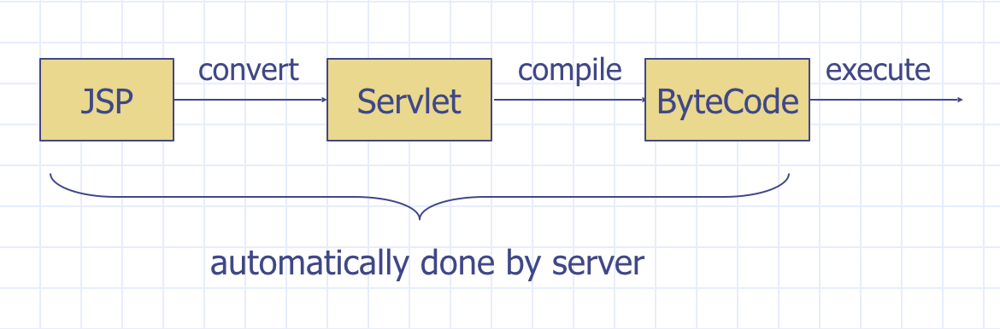
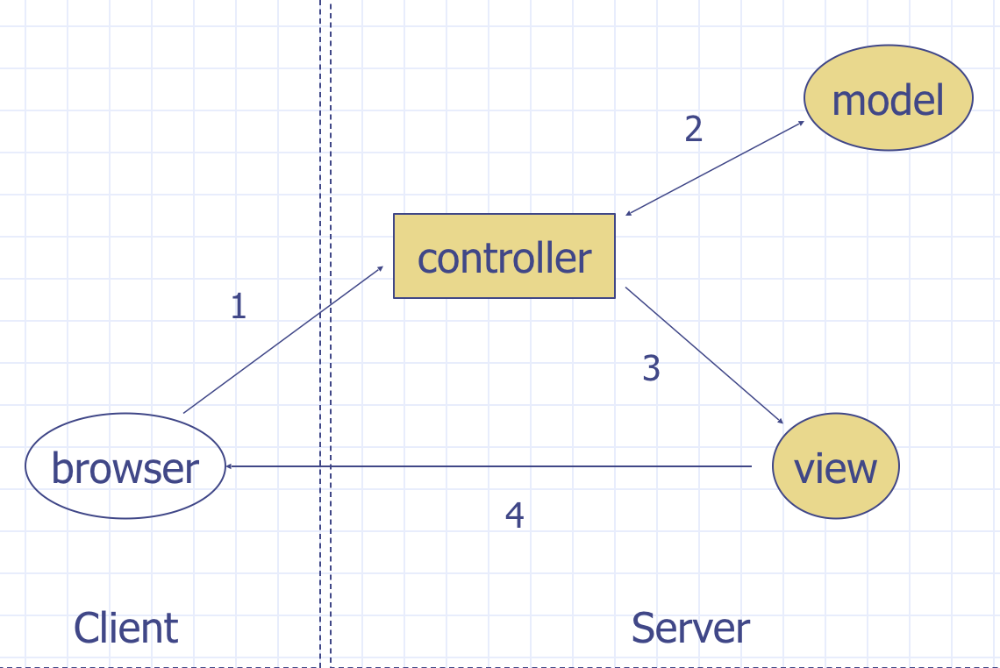
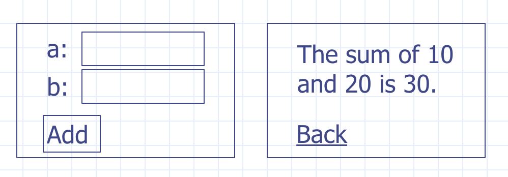
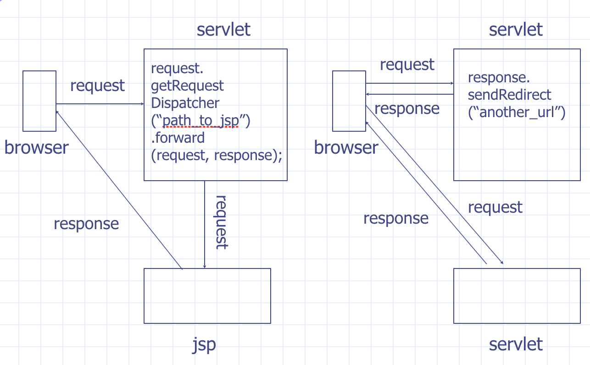

# JSP & JSTL

## Agenda

### Lecture

* [Java Server Page](#java-server-page)
* [MVC Architecture](#mvc-architecture)
* [Expression Language(EL)](#expression-language)
* [JSTL (tag)](#jsp-standard-tag-library)
* [Custom Tag Library](#custom-tag-library)

### Lab

* Install JSTL lib in Tomcat
* Implement basic server side rendering

## Java Server Page

Before we start talking about the detail of the JSP (Java Server Page), we will
need to know why we need the JSP as to pure Servlet. In Java Servlet, we are putting
HTML in the out.println method. Rather, we are just generating the response body
as a single string. This is getting tedious at some point. Plus, the String
response body doesn't allow us to separate out the presentation from the processing.

Therefore, we will need something better than String response output, specifically
using JSP to code element embedded in the HTML document.

```jsp
<!DOCTYPE html>
<html lang="en">
<head>
	<meta charset="UTF-8">
	<title></title>
</head>
<body>
	JSP can be treated the same way as HTML without Data.
</body>
</html>
```

### Two ways to use JSP

There are briefly two ways you can use JSP. We will be going over how these
two ways varies:

* JSP the old way (e.g. wrong way)
	* HTML + Java Code
* JSP as a template engine
	* HTML + EL/JSTL

#### Old way

```jsp
<!DOCTYPE html>
<html>
<head><meta charset="UTF-8"><title>Add1</title></head>
<body>
<p>The sum of <%= request.getParameter("a") %>
and <%= request.getParameter("b") %> is
<%= Integer.parseInt(request.getParameter("a"))
+ Integer.parseInt(request.getParameter("b")) %>
</p>
</body>
</html>
```

Check [addition.jsp](../src/main/webapp/addition.jsp) for concrete example

#### New way

```jsp
<!DOCTYPE html>
<html>
<head>
    <meta charset="UTF-8"><title>Add2</title>
</head>
<body>
  <p>The sum of ${param.a} and ${param.b} is
  ${param.a + param.b}.</p>
</body>
</html>
```

Check [addition_new.jsp](../src/main/webapp/addition_new.jsp) for concrete example

### How JSP works



* You can look under `$TOMCAT_HOME/work/Catalina/localhost/context_name` to see
generated Java Servlet files

### JSP the old way -- RequestCounter.jsp

```
<%! int counter = 1; %>             <%-- JSP variable declaration --%>
<!DOCTYPE html>
<html>
<head>
<meta charset="UTF-8">
<title>Request Counter</title>
</head>
<body>You are visitor #
<%= counter %>.                     <%-- JSP expression --%>
<% ++counter; %>                    <%-- JSP Scriplet --%>
</body>
</html>
```

Check [request-counter.jsp](../src/main/webapp/request-counter.jsp) for concrete example

### Why JSP the old way is the wrong way?

Mixing presentation and processing logic makes the program very hard to understand
and maintain. Additionally, you will have hard time to reuse the code in a clean
way.

Then what is the benefit of using JSP as template engine?

A template engine combines templates with data to produce documents. In other
word, JSP should be used to display data and no more.

You may ask:

* Who is going to do the processing?
* Where does data come from?
* How to display data without using Java?

## MVC Architecture

MVC stands for Model-View-Controller. Model for data, controller for processing and
view for display.

MVC architecture is a common software architecture used for Web and GUI application.



1. Browser sends a request to controller
2. Controller processes the request, update some data
3. Controller forwards the request and data to view
4. View generates the response that is sent back to the client

In detail:

* Model: regular Java classes (aka. bean, or POJO - Plain Old Java Object)
* Controller: Servlet
* View: JSP

### Example using MVC



Check [CalServlet.java](../src/main/java/edu/csula/cs3220/examples/CalServlet.java), [cal.jsp](../src/main/webapp/WEB-INF/cal.jsp) & [cal-result.jsp](../src/main/webapp/WEB-INF/cal-result.jsp) for concrete example

Again, the web application is just data plus operations. To create this example,
lets start by defining the data model classes. Although at this case, we don't
need to define a custom Java Classes (as integer is built in).

Then define one Servlet per operation using `doGet()` to display form and `doPost()`
to process form submission.

Finally, keep it simple so that one JSP is used per view.

Important concept here is:

```java
request.getRequestDispatcher("path_to_jsp")
	.forward(request, response);
```

### Forward vs Redirect



### Send data from Controller to View

* Objects in application and session scope are shared by all Servlets and JSPs
of the application
* Additional data can be passed from Servlet to JSP in request scope

Request scope:

```java
request.setAttribute("key", value);
request.getRequestDispatcher("path_to_jsp")
	.forward(request, response);
```

### More about MVC example

* Request should always go to controllers first
	* Hide JSPs under /WEB-INF so that user cannot access JSP directly
* Controllers do not generate HTML
	* No `out.println()`
* JSPS are only used for display
	* No Java code in JSP

## Expression Language

Expression language is a concise way to access data in JSP since JSP 2.0 
specification. Syntax looks like: `${expression}`

### Elements of a programming language

* Comments
* Literals
* Variables and types
* Operators
* **Expressions**: anything that evaluates to a single value
* Statements
* Functions
* Classes
* Packages

#### Comments

```
<%-- JSP (hidden) comments --%>
<!-- HTML comments -->
```

#### EL Literals


```
${true}, ${false}

${23}, ${0x10}

${6.5}, ${1.1e13}

${"double-quoted string"}, ${'single-quoted string'}

${null}
```

Check [CalServlet.java](../src/main/java/edu/csula/cs3220/examples/CalServlet.java), [cal.jsp](../src/main/webapp/WEB-INF/cal.jsp) & [cal-result.jsp](../src/main/webapp/WEB-INF/cal-result.jsp) for concrete example

#### EL Variables

You cannot declare a new variable using EL (After all, it's called expression language.)

However, you can access implicit objects, scoped variables (e.g. the objects saved
in application, session and request scopes), and their properties

##### What are a properties?

```java
class User {
	// Fields (beginning)
	private final String firstName;
	private final String lastName;
	// feilds (end)

	// Constructor (beginning)
	public User(String firstName, String lastName) {
		this.firstName = firstName;
		this.lastName = lastName;
	}
	// constructor (end)

	// Methods (beginning)
	public String getFirstName() {
		return firstName;
	}
	
	public String getLastName() {
		return lastName;
	}
	// methods (end)
}
```

##### About properties

Property naming conventions should be *lowerCaseCamelCase*

You may have defined properties in following different types:

* read-only property: (only getter)
* write-only property: (only setter)
* read-write property: both

Then you can access properties from EL as followed:

```
${objectName.propertyName}
```

Check [CalServlet.java](../src/main/java/edu/csula/cs3220/examples/CalServlet.java), [cal.jsp](../src/main/webapp/WEB-INF/cal.jsp) & [cal-result.jsp](../src/main/webapp/WEB-INF/cal-result.jsp) for concrete example

There are some implicit objects in EL within JSPs:

* pageContext
	* servletContext
	* session
	* request
	* response
* param, paramValues
* header, headerValues
* cookie
* initParam
* pageScope
* requestScope
* sessionScope
* applicationScope

Example: requestInfo.jsp

Display some information about the request:

* Client address
* Cookie and parameters

User of implicit objects:

* Find Java class type for the Object
* Look for getters in the API
	* ${pageContext.request.remoteAddr}
* Access elements in a collection
	* cookie and param

Check [CalServlet.java](../src/main/java/edu/csula/cs3220/examples/CalServlet.java), [cal.jsp](../src/main/webapp/WEB-INF/cal.jsp) & [cal-result.jsp](../src/main/webapp/WEB-INF/cal-result.jsp) for concrete example

#### EL Operators

* Arithmetic
	* +, -, \*, /, %
	* div, mod
* Logical
	* &&, ||, !
	* and, or, not
* Relational
	* ==, !=, <, >, <=, >=
	* eq, ne, lt, gt, le, ge
* Conditional
	* ?, :
* empty
	* check whether a value is null or empty
* Other
	* [], ., ()

### Limitation of EL

Developers are only allowed to use expressions but not any statements. Especially
no control-flow statements.

To resolve this issue, you will need to know JSTL.

## JSP Standard Tag Library

You can use some custom tag in JSP as followed:

```jsp
<%@ taglib prefix="c" uri="http://java.sun.com/jsp/jstl/core" %>
<html><head><title>JSTL Hello</title></head>
<body>

<c:out value="Hello World in JSTL." />

</body>
</html>
```

### taglib Directive

* URI
	* A unique identifier for the tag library
	* NOT a URL
* Prefix
	* A short name for the tag library
	* Could be arbitrary name

### JSP Standard Tag Library (JSTL)

| Library | URI | Prefix |
| :--     | :-- | :--    |
| Core | http://java.sun.com/jsp/jstl/core | c |
| XML Processing | http://java.sun.com/jsp/jstl/xml | x |
| I18N Formatting | http://java.sun.com/jsp/jstl/fmt | fmt |
| Database Access | http://java.sun.com/jsp/jstl/sql | sql |
| Functions | http://java.sun.com/jsp/jstl/functions | fn |

### Important JSTL Tags and Functions

* Flow control
	* `<c:if>`
	* `<c:choose>`
		* `<c:when>`
		* `<c:otherwise>`
	* `<c:forEach>`
* URL
	* `<c:url>`
* Output
	* `<c:out>`
* Formatting
	* `<fmt:formateDate>`
	* `<fmt:formatNumber>`
* Functions
	* `<fn:length>`

#### Branch tags

```
<c:if test="${a.weekdays[0] == 'mon'}">Monday</c:if>
```

Check [JSTLExampleServlet.java](../src/main/java/edu/csula/cs3220/examples/JSTLExampleServlet.java) & [jstl-example.jsp](../src/main/webapp/WEB-INF/jstl-example.jsp) for concrete example


The type of the test attribute is boolean, which requires EL; "a.weekday[0] == 'mon'"
would be just a string.

```
<c:choose>
    <c:when test="${a.weekdays[3] == 'tue'}">
        Tuesday
    </c:when>
    <c:when test="${a.weekdays[3] == 'wed'}">
        Wednesday</c:when>
    <c:when test="${a.weekdays[3] == 'thr'}">
        Thursday
    </c:when>
    <c:otherwise>Friday</c:otherwise>
</c:choose>
```

Check [JSTLExampleServlet.java](../src/main/java/edu/csula/cs3220/examples/JSTLExampleServlet.java) & [jstl-example.jsp](../src/main/webapp/WEB-INF/jstl-example.jsp) for concrete example

#### Loop Tag `<c:forEach>`

```
<ul>
    <c:forEach items="${a.numbers}" var="number">
        <li>${number}</li>
    </c:forEach>
</ul>
```

Check [JSTLExampleServlet.java](../src/main/java/edu/csula/cs3220/examples/JSTLExampleServlet.java) & [jstl-example.jsp](../src/main/webapp/WEB-INF/jstl-example.jsp) for concrete example

> The type for items need to be a "Collection"

> It's like an "enhanced for loop"

* Use `varStatus` variable to get the information of each iteration
* http://docs.oracle.com/javaee/5/jstl/1.1/docs/api/javax/servlet/jsp/jstl/core/LoopTagStatus.html

```
<ul>
    <c:forEach items="${a.numbers}" var="number"
          varStatus="status">
        <li>${status.index}: ${number}</li>
    </c:forEach>
</ul>
```

Check [JSTLExampleServlet.java](../src/main/java/edu/csula/cs3220/examples/JSTLExampleServlet.java) & [jstl-example.jsp](../src/main/webapp/WEB-INF/jstl-example.jsp) for concrete example

#### URL Tag `<c:url>`

```
<a href="<c:url value='/JSTLTest' />">A</a>
```

Check [JSTLExampleServlet.java](../src/main/java/edu/csula/cs3220/examples/JSTLExampleServlet.java) & [jstl-example.jsp](../src/main/webapp/WEB-INF/jstl-example.jsp) for concrete example

> For `<c:url>` tag, a URL starts with "/" is relative to the application root
instead of the server root.

#### Format date and time with `<fmt:formatDate>`

```
<fmt:formatDate value="${a.date}" type="date" />

<fmt:formatDate value="${a.date}" type="time" />

<fmt:formatDate value="${a.date}" type="both" />

<fmt:formatDate value="${a.date}"
        pattern="yyyy-M-d h:m:s a" />
```

Check [JSTLExampleServlet.java](../src/main/java/edu/csula/cs3220/examples/JSTLExampleServlet.java) & [jstl-example.jsp](../src/main/webapp/WEB-INF/jstl-example.jsp) for concrete example

> See http://download.oracle.com/javase/7/docs/api/java/text/SimpleDateFormat.html
for the date formatting patterns.

#### Format number with `<fmt:formatNumber>`

```
<fmt:formatNumber value="${number}" type="number" />

<fmt:formatNumber value="${number}" type="currency" />

<fmt:formatNumber value="${number}" type="percent" />

<fmt:formatNumber value="${number}" pattern="0.##" />
```

> See https://docs.oracle.com/javase/7/docs/api/java/text/DecimalFormat.html
for the number formatting patterns.

#### Example: Convert Guestbook to JSP and JSTL

See src/main/java

## Custom Tag Library

In additional to the standard tag library, developers can also define the custom
tag libraries themselves.

To define a custom JSP tags:

* Implement a tag
	* Using Java code
	* Using a tag file (basically a JSP file)
* Declare the tag in a Tag Library Descriptor (TLD) file

### Example: Hello

```
<cs3220:hello />
```

```java
package edu.csula.cs3220.examples.tags;

import javax.servlet.jsp.tagext.*;
import javax.servlet.jsp.*;
import java.io.*;

public class HelloTag extends SimpleTagSupport {
   public void doTag() throws JspException, IOException {
      JspWriter out = getJspContext().getOut();
      out.println("Hello Custom Tag!");
   }
}
```

```tld
<taglib>
   <tlib-version>1.0</tlib-version>
   <jsp-version>2.0</jsp-version>
   <short-name>Example TLD</short-name>

   <tag>
      <name>Hello</name>
      <tag-class>edu.csula.cs3220.examples.tags.HelloTag</tag-class>
      <body-content>empty</body-content>
   </tag>
</taglib>
```

> Store above file under `WEB-INF/custom.tld`

To use it:

```
<%@ taglib prefix="cs3220" uri="custom.tld"%>

<html>
   <head>
      <title>A sample custom tag</title>
   </head>

   <body>
      <cs3220:Hello/>
   </body>
</html>
```

Check [JSTLExampleServlet.java](../src/main/java/edu/csula/cs3220/examples/JSTLExampleServlet.java) & [jstl-example.jsp](../src/main/webapp/WEB-INF/jstl-example.jsp) for concrete example

More examples to build `add` tag

Before start defining the custom add tag, we will need to understand TLD file (
Tag Library Descriptor):

* A JSP custom tag must belong to a tag library
* TLD is just an XML document that contains information about a tag library and
the tags in the library
* TLDs are used by application servers and development tools to validate the tag
* A TLD file must have the `.tld` suffix
* Locations for TLD:
	* War or unpackaged: `WEB-INF` or its subdirectories, except `WEB-INF/classes`
and `WEB-INF/lib`
	* JAR: `META-INF` or its subdirectories

### Declaration for AddTag

addTag.tld

```xml
<tag>
    <name>add</name>
    <tag-class>cs3220.tag.AddTag</tag-class>
    <body-content>empty</body-content>
    <attribute>
        <name>op1</name>
        <required>true</required>
        <rtexprvalue>true</rtexprvalue>
    </attribute>
    <attribute>
        <name>op2</name>
        <required>true</required>
        <rtexprvalue>true</rtexprvalue>
    </attribute>
</tag>
```

AddTag.java

```java
package edu.csula.cs3220.examples.tags;

import java.io.IOException;

import javax.servlet.jsp.JspException;
import javax.servlet.jsp.JspWriter;
import javax.servlet.jsp.tagext.SimpleTagSupport;

public class AddTag extends SimpleTagSupport {
	int op1, op2;

	public AddTag () {
		op1 = op2 = 0;
	}

	public void setOp1(int i) {
		this.op1 = i;
	}

	public void setOp2(int i) {
		this.op2 = i;
	}

	public void doTag() throws JspException, IOException {
		JspWriter out = getJspContext().getOut();
		out.print( op1 + op2 );
	}
}
```

TaglibTest.jsp

```jsp
<%@ taglib prefix="cs3220"
    uri="http://cs.calstatela.edu/cs3220/stu31" %>
<!DOCTYPE html>
<html>
<head><title>TaglibTest</title></head>
<body>
    The sum of ${param.a} and ${param.b} is
    <cs3220:add op1="${param.a}" op2="${param.b}" />.
</body>
</html>
```

Check [JSTLExampleServlet.java](../src/main/java/edu/csula/cs3220/examples/JSTLExampleServlet.java) & [jstl-example.jsp](../src/main/webapp/WEB-INF/jstl-example.jsp) for concrete example
