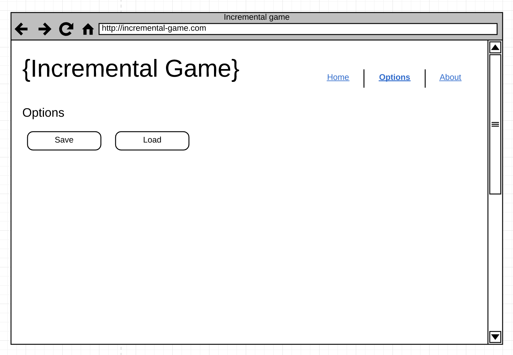

# Lab 1 [5 pts]

## Deliverables

* index.html [2pt]
    * Navigation
    * Header
    * Footer
    * Le button to increment counter
    * Resource list
* options.html [1pt]
    * Keeping same layout as index.html
    * Options to adjust game
* about.html [1pt]
    * Keeping same layout as index.html
    * Explain the game idea
* app.css [1pt]
    * Styles used for the pages
* Pushes changes to Github pages
* CSNS file showing URL of Github pages & Github pull request

Example CSNS file format:

```
Application URL:
https://csula-students.github.io/cs-3220-spring-2018-rcliao/

Github Pull Request URL:
https://github.com/csula-students/cs-3220-spring-2018-rcliao/pull/1
```

### Bonus [2pt]

If your website is mobile friendly, you will get additional 2 points.

> Mobile friendly being that it's not small on mobile screen and optimize the UI
> so that user only need to do vertical scroll

Mobile friendly being it shows correct resolution on the mobile screen (if I
access the site from my Android phone). And the navigation is also mobile friendly.

## Description

In this lab, we want to create all customer facing pages for the incremental game.
This includes the homepage (index.html) and about page (about.html) as well as
options page (options.html).

In addition to create all these pages, we also need to ensure the navigation
between pages is done correctly and therefore, it is important for you to
create a navigation bar in header.

> Please note that although we have learned the existence of CSS framework 
like Material or Bootstrap in class earlier, refrain yourself from using it for
the sake of this lab – testing your HTML & CSS knowledge.

> In other word, you are **not** allowed to use those framework in this lab.

In additional to the HTML pages above, you will also need to create a separate
`app.css` file that contains all your styling changes. In all these pages, you
should have this `app.css` imported to apply styles to each component accordingly.

When finish, you should have quite nice looking customer facing portion of the
incremental game – able to see the interfaces of the game without any interactions.

## Requirements

### index.html

In this page, you want to have the page structure set up properly (including the
header, navigation, footer and the main content area) along with importing the
CSS in the right place (header preferably).

In other word, your page structure should be set up correctly so that other
page can just fill in the blank in the body area (template like).

### about.html

Keeping the same layout as the `index.html` above – as having the same header and
footer.

In the body area, please write up to 2 paragraph of what your game is about.

### options.html

Keeping the same laoyut as the `index.html` above – as having the same header
and footer.

In the body area, please add up a button to export game state and a button to
import button game state.

> We will not implement the functionality here just yet but the user interface
> need to be there

### app.css

You will need to have the minimum styles for the above requirements. Each
component (e.g. food item in the menu) should be styled here. Therefore, that
ends up with the following styles:

* Layout on the index.html
	* Header
	* Footer
	* Navigation
* Le Button
* Story book component
* Resource list

Here is the basic UI starting point,




> Although UI mockup is provided, students are welcome to come up with own
design as long as all the requirements above are satisfied.

## Instructions

### Set up

Similar to exercise we have done earlier, you will need a *text editor* and *git
bash* (terminal on MacOS) ready. In additional to the programming set up, you
will also need a modern browser open (preferably Chrome or Firefox).

Once you have all the necessary items above ready, please go to your student
repository directory and follow the following commands:

```sh
# To start and switch to a new branch called "lab1"
git checkout -b lab1
```

After you switch to branch, you can type in `git branch` and the branch should
show `* lab1`. When you see you are on the lab1 branch, you are ready to start
coding now.

### Get Started

Lets start by creating a new folder called "lab1" first:

```sh
# To create a new directory under the current directory
mkdir lab1

# Switch the current directory to lab1
cd lab1
```

And then you should start by creating the `index.html` in this "lab1" folder
including the following code snippet to begin with:


```html
<!DOCTYPE html>
<html lang="en">
<head>
	<meta charset="UTF-8">
	<title>Homepage</title>
</head>
<body>
	<h1>Hello world!</h1>
</body>
</html>
```

Happy hacking!
