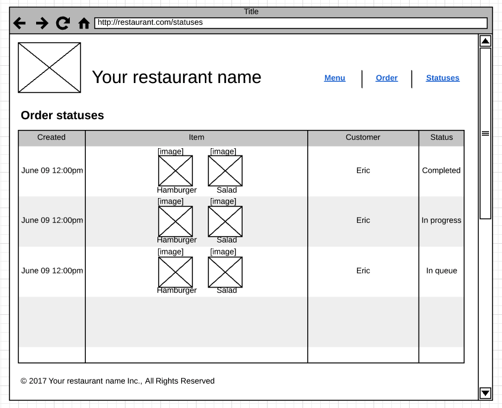
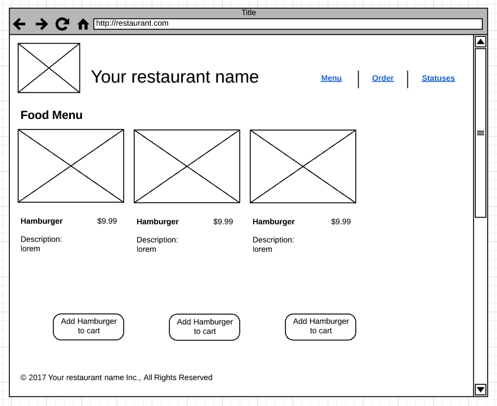
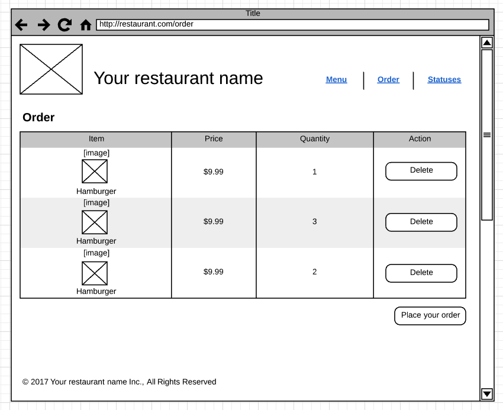

# Lab 1 [5 pts]

## Deliverables

* Index.html [2pt]
	* Navigation
	* Header
	* Footer
* Statuses.html [1pt]
* Menu.html [1pt]
* app.css [1pt]
	* Styles used for the pages
* Pushes changes to Github pages
* CSNS file showing URL of Github pages & Github pull request

Example CSNS file format:

```
Application URL:
https://csula-students.github.io/cs-3220-summer-2017-rcliao/

Github Pull Request URL:
https://github.com/csula-students/cs-3220-summer-2017-rcliao/pull/1
```

### Bonus [2pt]

If your website is mobile friendly, you will get additional 2 points!

Mobile friendly being it shows correct resolution on the mobile screen (if I
access the site from my Android phone). And the navigation is also mobile friendly.

## Description

In this lab, we want to create all customer facing pages for the restaurant application.
This includes the homepage (index.html), order statuses (statuses.html) and
food menu (menu.html).

In addition to create all these pages, we also need to ensure the navigation
between pages is done correctly and therefore, it is important for you to
create a navigation bar in header.

> Please note that although we have learned the existence of CSS framework 
like Material or Bootstrap in class earlier, refrain yourself from using it for
the sake of this lab (testing your HTML & CSS knowledge).

> In other word, you are **not** allowed to use those framework in this lab.

In additional to the HTML pages above, you will also need to create a separate
`app.css` file that contains all your styling changes. In all these pages, you
should have this app.css applying styles to each element.

When finish, you should have quite nice looking customer facing portion of the
restaurant site (allowing customer to order from the food menu and seeing their
order status).

## Requirements

### Index.html

In this page, you want to have the page structure set up properly (including the
header, navigation, footer and the main content area) along with importing the
CSS in the right place (header preferably).

In other word, index.html is like a template set up for other pages to copy
and paste into the main content area. It's like a layout definition.

### Menu.html

Food menu needs to display a couple informations:

* A list of food on menu
	* At least three food items need to be displayed
* Food order form
* Confirmation on the order
* Should also have the same header/footer/navigation from the index.html
	* Copy and paste from index.html is fine for this lab

### Statuses.html

Order statuses page needs to show customer what is their order statuses. You will
need to show the following information:

* A list of customer orders
	* Timestamp (when they order)
	* Food item (what they order)
	* Status indicator [queue, in progress, ready to pick up, completed]
* Should also have the same header/footer/navigation from the index.html
	* Copy and paste from index.html is fine for this lab

### App.css

You will need to have the minimum styles for the above requirements. Each
component (e.g. food item in the menu) should be styled here. Therefore, that
ends up with the following styles:

* Layout on the index.html
	* Header
	* Footer
	* Navigation
* Food item in menu style
* Food order form style
* Confirmation component
* Customer order item

Here is the basic UI starting point,





> Although UI mockup is provided, students are welcome to come up with own
design as long as all the requirements above are satisfied.

## Instructions

### Set up

Similar to exercise we have done earlier, you will need a text editor and git
bash (terminal on MacOS) ready. In additional to the programming set up, you
will also need a browser open (preferably Chrome due to its amazing developer
tools).

Once you have all the necessary items above ready, please go to your student
repository directory and follow the following commands:

```sh
# To start and switch to a new branch called "lab1"
git checkout -b lab1
```

After you switch to branch, you can type in `git branch` and the branch should
show `* lab1`. When you see you are on the lab1 branch, you are ready to start!

### Get Started

Lets start by creating a new folder called "lab1" first:

```sh
# To create a new directory under the current directory
mkdir lab1

# Switch the current directory to lab1
cd lab1
```

And then you should start by creating the `index.html` in this "lab1" folder
including the following code snippet to begin with:


```html
<!DOCTYPE html>
<html lang="en">
<head>
	<meta charset="UTF-8">
	<title>Homepage</title>
</head>
<body>
	<h1>Hello world!</h1>
</body>
</html>
```

Happy hacking!
