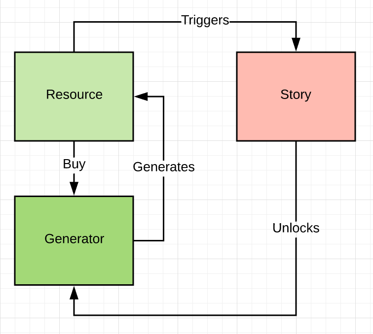
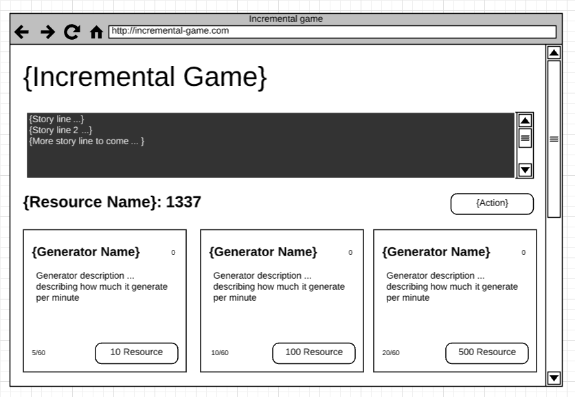

# Lab 1 [5 pts]

## Deliverables

* theme.txt
* index.html [2pt]
    * Header
    * Footer
    * Le button to increment counter
    * Resource list
    * Generator list
* app.css [1pt]
    * Styles used for the pages
* Pushes changes to Github pages
* CSNS file showing URL of Github pages & Github pull request

Example CSNS file format:

```
Application URL:
https://csula-students.github.io/cs-3220-spring-2018-rcliao/

Github Pull Request URL:
https://github.com/csula-students/cs-3220-spring-2018-rcliao/pull/1
```

## Description

We want to build an [incremental game][1] throughout this semester. First thing
is to build the *user interface* layer and *picking a theme* for the game.

What is incremental game you ask? Incremental game, at its core, is to have user
click on a button and increment its value. After having over certain value, user
can purchase the generator to generate value automatically without user interaction
afterward.

You mentioned something about theme earlier, what do you mean? Even though students
will build the same genre of the game (incremental game), each student may or may
not build the same game. Some of the game content could be different from one to
the other. Theme should separate students' work a bit. In example, one student
may build a dungeon related theme while the other may build a BitCoin related
theme. In this assignment, while designing the user interface, students are also
required to pick their incremental game theme.

Once a theme is selected, students are also required to code up their project
in HTML & CSS (see deliverables above).

> Please note that although we have learned the existence of CSS framework 
like Material or Bootstrap in class earlier, refrain yourself from using it for
the sake of this lab – testing your HTML & CSS knowledge.

> In other word, you are **not** allowed to use those framework in this lab.

In additional to the HTML pages above, you will also need to create a separate
`app.css` file that contains all your styling changes. In all these pages, you
should have this `app.css` imported to apply styles to each component accordingly.

When finish, you should have a nice looking incremental game – able to see the
interfaces of the game without any interactions.

## Requirements

### theme.txt

To start, here are a few example themes:

* Cookie clicker
* Dungeon crawler
* Farmville

After picking a theme, you will need to define a few core components as following
format:

```
Theme:
# Cookie clicker

Resource:
* Cookie

Generators:
* Cursor
* Grandmom
* Cookie Factory

Story:
* Cookie? Click on the button to create cookies.
* Your cookies are talked about for miles around.
* C is for cookie. And that is good enough for me.
```



* Resource is the primary unit of the game.
* Generators are autonomous unit that generates resource
* Story are like checkpoints with description after user gets certain value of resource

### index.html

In this page, you want to have the page structure set up properly (including the
header, navigation, footer and the main content area) along with importing the
CSS in the right place (header preferably).

In other word, your page structure should be set up correctly so that other
page can just fill in the blank in the body area (template like).

### app.css

You will need to have the minimum styles for the above requirements. Each
component (e.g. food item in the menu) should be styled here. Therefore, that
ends up with the following styles:

* Layout on the index.html
	* Header
	* Footer
* Le Button
* Story book component
* Resource list
* Generator list

Here is the basic UI starting point,



> Although UI mockup is provided, students are welcome to come up with own
design as long as all the requirements above are satisfied.

## Instructions

### Set up

Similar to exercise we have done earlier, you will need a *text editor* and *git
bash* (terminal on MacOS) ready. In additional to the programming set up, you
will also need a modern browser open (preferably Chrome or Firefox).

Once you have all the necessary items above ready, please go to your student
repository directory and follow the following commands:

```sh
# To start and switch to a new branch called "lab1"
git checkout -b lab1
```

After you switch to branch, you can type in `git branch` and the branch should
show `* lab1`. When you see you are on the lab1 branch, you are ready to start
coding now.

### Get Started

Lets start by creating a new folder called "lab1" first:

```sh
# To create a new directory under the current directory
mkdir lab1

# Switch the current directory to lab1
cd lab1
```

And then you should start by creating the `index.html` in this "lab1" folder
including the following code snippet to begin with:

```html
<!DOCTYPE html>
<html lang="en">
<head>
	<meta charset="UTF-8">
	<title>Homepage</title>
</head>
<body>
	<h1>Hello world!</h1>
</body>
</html>
```

Happy hacking!

[1]: https://en.wikipedia.org/wiki/Incremental_game
