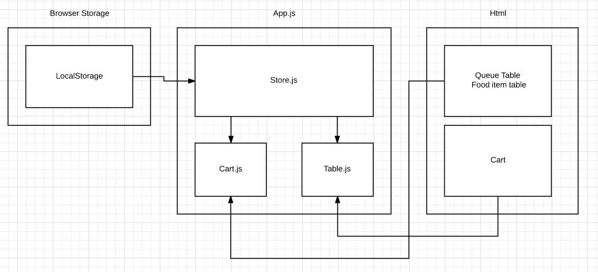
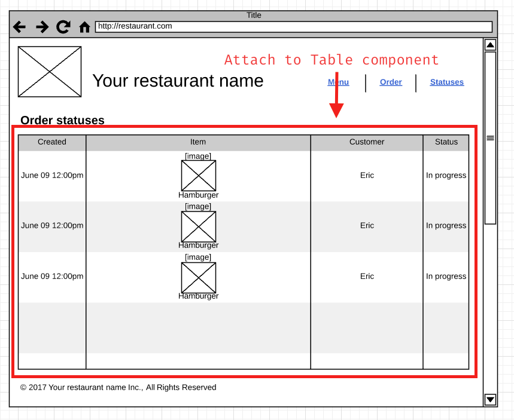
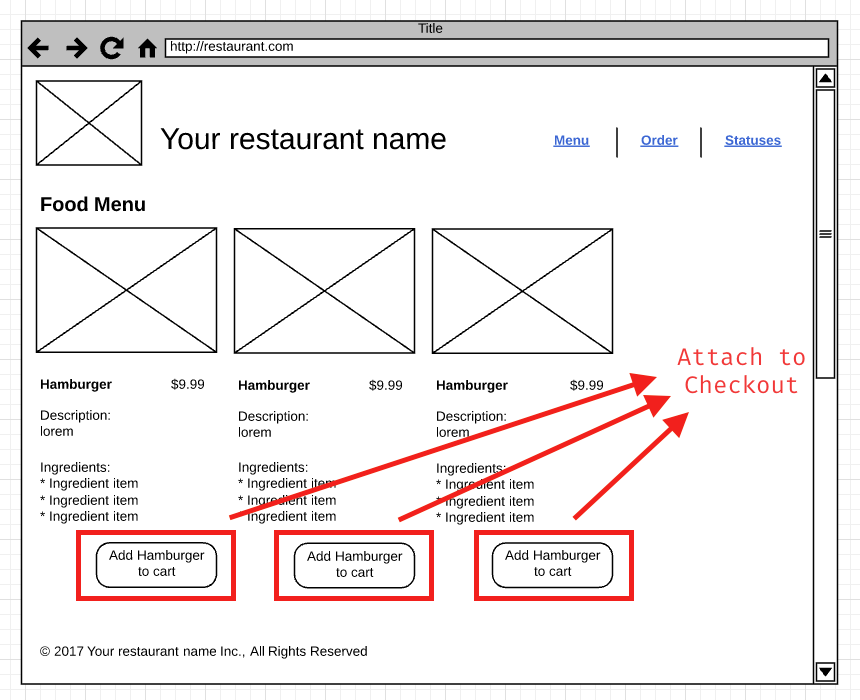
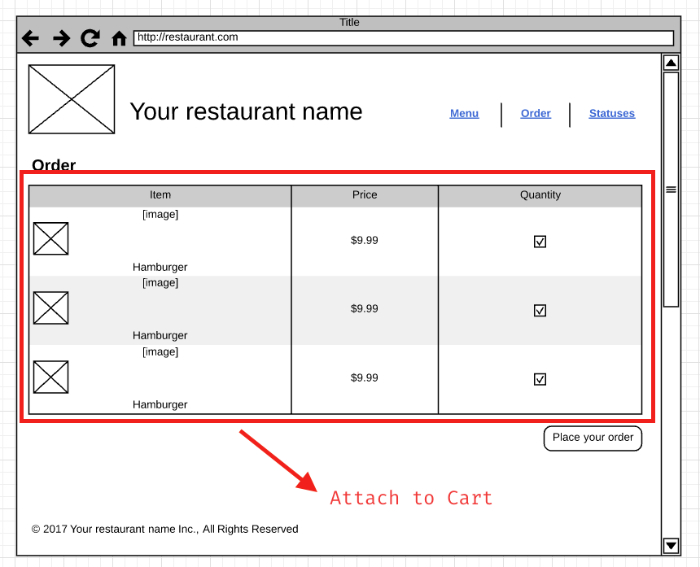

# Lab 2

## Deliverables

* Checkout button [2 pts]
* Cart component [3 pts]
* app.js

### Bonus

* Table including sorting [2 pts]

> Please specify in the pull request description if you have done table sorting component.

## Description



Using the component pattern learned in the lecture earlier, your job is
to implement shopping cart as well as the data table functionalities.

With shopping cart and data table added to our restaurant application, it should
have some basic e-commerce functionalities -- allowing our customer to order
food!

Visual representation can be found below:





## Requirements

Functional requirements wise, you will need to implement an app.js starting 
with following code:

> Many instructions is included below in the comment, please read them wisely

```js
// single state store
class Store {
    constructor (storage) {
        this.storage = storage; // assuming local storage will be passed in as storage
        // these are the key name you can use in Store
        this.CART_KEY = 'CART';
        this.QUEUE_KEY = 'QUEUE';
        this.FOODS_KEY = 'FOODS';
    }

    // you can get item by store.cartItems
    get cartItems () {
        return JSON.parse(this.storage.getItem(this.CART_KEY));
    }

    // to call setter, simply "assign" like store.cartItems = something
    set cartItems (cartItems) {
        this.storage.setItem(this.CART_KEY, JSON.stringify(cartItems));
    }

    get queue () {
        return JSON.parse(this.storage.getItem(this.QUEUE_KEY));
    }

    set queue (queue) {
        this.storage.setItem(this.QUEUE_KEY, JSON.stringify(queue));
    }

    get foods () {
        return JSON.parse(this.storage.getItem(this.FOODS_KEY));
    }

    set foods (foods) {
        this.storage.setItem(this.FOODS_KEY, JSON.stringify(foods));
    }
}

class Cart {
    // take dom element into JavaScript class to attachment events
    constructor(root, store) {
        this.root = root;
        this.store = store;
        this.items = this.store.cartItems;
        this.init();
    }

    init () {
        // Render a list of items under root element
        this.render();
        // TODO: attach remove cart items to rendered HTML
    }

    destroy () {
        // TODO: remove all the events attached from init
    }

    // remove an item from shopping cart
    removeItem (item) {
        // TODO: logic to remove an item from cart
        // call render method when the item is removed to update view
        this.render();
    }

    placeOrder () {
        // add item to statuses in store as status "in progress"
    }

    // render a list of item under root element
    render () {
        console.log(this.store.cartItems);
        let tbody = this.root.querySelector('tbody');
        // using innerHTML to render a list of table row item under tbody
        tbody.innerHTML = `<tr class="item">
            <td>test</td>
            <td>test</td>
            <td>test</td>
        <tr>`
    }
}

class CheckoutButton {
    constructor(root, store) {
        this.root = root;
        this.store = store;
        this.onClick = () => this.addItemToCart();
        this.init();
    }

    init () {
        this.root.addEventListener('click', this.onClick);
    }

    destroy () {
    }

    addItemToCart () {
        // hint: you can use `dataset` to access data attributes
        // See passing data from HTML to JavaScript from course note
        let cartItems = this.store.cartItems || [];
        // TODO: replace with actual item
        console.log(this.root.dataset);
        cartItems.push({
            name: 'test'
        });
        console.log(cartItems);
        this.store.cartItems = cartItems;
    }
}

class StatusTable {
    // take dom element into JavaScript class to attachment events
    constructor(root, store) {
        this.root = root;
        this.store = store;
        init();
    }

    init () {
        // attach click event listener to table header row on each column
        render();
    }

    destroy () {
        // remove all the events attached from init
    }

    sort (columnName) {
        // after sorting the array of statuses, re render item to update view
        render();
    }

    // render rows of items under table using root.innerHTML
    render () {

    }
}

// DOMContentLoaded event will allow us to run the following function when
// everything is ready. Think of the following code will only be executed by
// the end of document
document.addEventListener('DOMContentLoaded', () => {
    // use querySelector to find the table element (preferably by id selector)
    // let statusTable = document.querySelector('');
    // // use querySelector to find the cart element (preferably by id selector)
    let cart = document.querySelector('.cart-table');
    let checkoutButtons = document.querySelectorAll('.checkout-button');

    let store = new Store(window.localStorage);
    // if (table) {
    //     new StatusTable(table, store);
    // }
    if (cart) {
        new Cart(cart, store);
    }
    if (checkoutButtons && checkoutButtons.length) {
        for (var i = 0; i < checkoutButtons.length; i ++) {
            new CheckoutButton(checkoutButtons[i], store);
        }
    }
});
```


