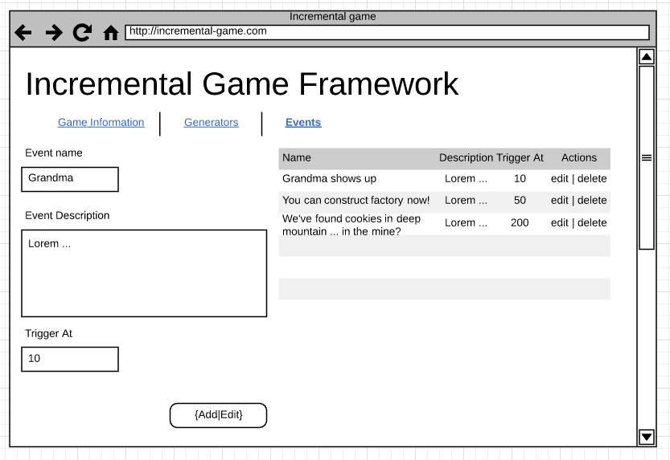

# Lab 4

## Deliverables

* Single txt file containing link to **the pull request** and **CS3 application**

Pull request should at least containing the following changed files:

* AdminEventsServlet.java
* MemoryEventsDAOImpl.java
* app.css

## Descriptions

In this lab, we will pick up what we implemented back in exercise-2 with the
proper backend functionality. To get started with, we will implement the events
configuration page like below:

And your mission is to create Java Servlets that:

* Display the page as above
* Handle the necessary persistence about event information

## Requirements

### Functional

* User should be able to create event passing event name, description and trigger value
* User should be able to see a list of events
* User should be able to modify a single event

### Technical

* Application needs to be deployed to CS3 server
* Application should store the event information in application scope
* Application should display HTML with proper CSS (similar to what you have accomplished in exercise-2)
