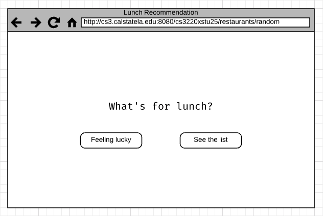
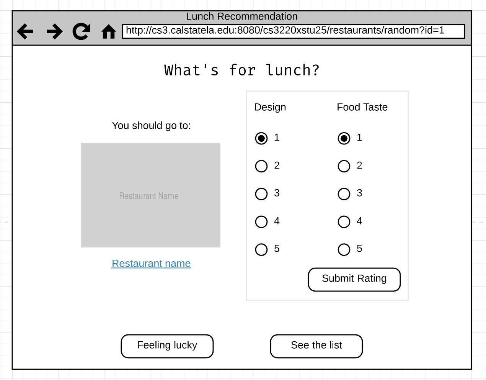
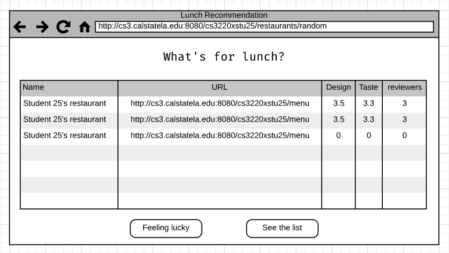
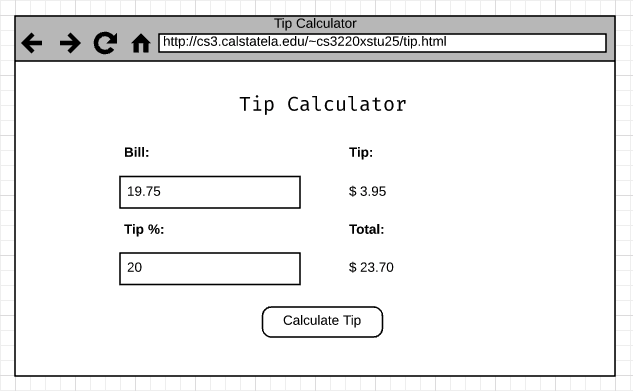

# Midterm

## Deliverables

* Deploy code to CS3 server
* RandomRestaurantServlet.java [5 pts]
* RandomRestaurantListServlet.java [2 pts]
* tip.js, tip.html & tip.css [3 pts]
* Pull request containing all the changes
* CSNS text file submission as followed:

```
application link:
http://cs3.calstatela.edu:8080/<username>/<servlet_or_jsp_name>

pull request URL:
https://github.com/csula-students/cs-3220-summer-2017-rcliao/pull/7
```

## Due date time

#### July 8th 12:30pm

## Description

To continue on other aspects of our restaurant application, we will be building
a quick **random lunch recommendation** application for the customer to find
a good place for lunch. In addition, we will be building a tip calculator
for customer to easily calculate tips.



After recommending a restaurant to customer, we want to also give them a chance
to rate the restaurant. In other word, after recommend, you want to have a form
allowing the customer to rate the restaurant design, functionality and so on.



> Mockup 1

Also, we want to show a list of restaurants if user prefer to see them all.



> Mockup 2

In addition, as another aspect of the American restaurant, we want to create a 
**tip calculator** for our customer to use as well!



> Mockup 3

To do so, you will need to provide a form to our customer in HTML and implement
the tip calculation in JavaScript and display the value accordingly.

> You can use this image as placeholder:


> Mockup 4

## Requirements

* Customer should be able to access to `http://cs3.calstatela.edu:8080/<username>/suggest/restaurants/random`
to see homepage (with a random restaurant showing up)
* Customer should be able to access to `http://cs3.calstatela.edu:8080/<username>/suggest/restaurants/random?id={restaurantId}`
to see a single restaurant given its id
* Customer should be able to access to `http://cs3.calstatela.edu:8080/<username>/suggest/restaurants/random/list`
to see a list of restaurants
* Customer should be able to `http://cs3.calstatela.edu/~<username>/tip.html` to
access tip calculator and calculate tip accordingly

## Instructions

### Overall URL mapping

| Servlet Name | URL Patterns |
| :--          | :--          |
| RandomRestaurantServlet.java | /suggest/restaurants/random |
| RandomRestaurantListServlet.java | /suggest/restaurants/random/list |

Also, you will need to upload your `tip.html` and `tip.js` into `public_html`
folder under CS3 server.

### Hint: Radio input

You will notice that there are a couple radio box input in the mockup. We haven't
done any radio box input before in the lab nor the homework. So, here is a couple
examples on how radio box works in the form:

```html
<form method="post">
	<input name="designRate" id="design_rate_1" type="radio" value="1" checked>
	<label for="design_rate_1">1</label>

	<input name="designRate" id="design_rate_2" type="radio" value="2">
	<label for="design_rate_2">2</label>
</form>
```

The important part about radio input is:

* All radio input related to same field need to have same `name`
* Value should be provided for each radio input differently (identicated what is
the value if selected)
* Should provide label where `for` value should be the same as radio input `id`

On the Java Servlet side, you can simply call `request.getParameter("designRate");`
to get the selected value of the radio box

### Random restaurants

#### Get started

Always started by defining the entry point with `RandomRestaurantServlet.java`
and display a proper HTML. (See mockup 1 above)

Once you have the HTML, you may want to generate the default data like below:

#### Data model: Restaurant

Before start hacking data in the application scope, you may want to take some
time to think about how you would design the data model for restaurant. Using
this chance, you want to look at the restaurant use cases and see what attributes
you would need. (e.g. you may need a name, URL, design rating, taste rating).

From here, you might ask, how do you store rating system? Lets keep it simple
by storing every customer's rating to a list of integer. That means the ratings
should be a list of integer and when you display the rating, you will simply
display the average number in this list.

In short, your restaurant class should contain:

* ID
* Name
* URL
* designRatings (List of integer)
* tasteRatings (List of integer)

#### Generate a list of restaurants

To start, we will need to generate a list of restaurants to recommend to our
customer.

Fortunately, we already know the pattern of our student application address as
followed:

```
http://cs3.calstatela.edu:8080/<username>/menu
```

Therefore, your first job should be generate a list of restaurant application
URLS as followed:

```
http://cs3.calstatela.edu:8080/cs3220xstu01/menu
http://cs3.calstatela.edu:8080/cs3220xstu02/menu
...
http://cs3.calstatela.edu:8080/cs3220xstu22/menu
```

> Notice that the only difference between each student is just the number after
"cs3220xstu". Therefore, all you need to do here should be a *for loop* to generate
22 List of String (to represent URLs)

Then you may store those URLs under **application scope** so you can display them.

#### Select random item

Starting from here, you may want to select a random item out of list of restaurants
above. To select a random item:

```
public Restaurant getRandomRestaurant(List<Restaurant> list) {
	return list.get(new Random().nextInt(list.size()));
}
```

### Tip Calculator

For tip calculator, you will be creating pure HTML, CSS and JavaScript application
and upload them to be under `public_html` folder.

You will need at least the following files:

* tip.html
* tip.js
* tip.css

> Note that your style needs to be somewhat similar to the mockup provided earlier

#### Hint: get input value

To get input value, you will need to do querySelector to find out the input element
first. Once you find out the element, then you can get its `value`. e.g.

```
let percentage = document.querySelector('#tip_percentage').value;
// PS. what you get from ".value" property is String, remember to cast it to int
```

> Remember the value you get from the `.value` call is string type. To do computation,
you will need to call `parseInt` before computation

#### Hint: Display text under DOM API

To display a text using DOM API, you can use `textContet` --
https://developer.mozilla.org/en-US/docs/Web/API/Node/textContent

Example:

```
document.querySelector('#top_amount').textContent = '$ 15.66';
```

