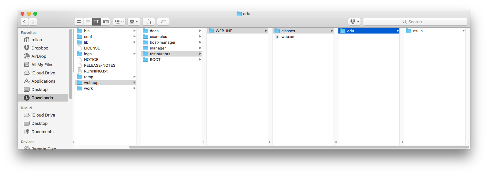

# Tomcat Servlet Survival Guide

The biggest frustration of the web development is probably the starting point.
The server set up!

In this article, we will be going through how to set up tomcat application server
with Servlets in several ways. You are free to pick and choose the way you prefer
your local environment is. On the production case, we will be running tomcat
on the CS3 server. Please be sure how you do the deployment!

Here are a couple ways you can run Servlet with tomcat locally:

* [Running with Gradle and Gretty](#gradle-gretty)
* [Running with IntelliJ](#intellij)
* [Running with Eclipse](#eclipse)
* [Running with Tomcat directly](#tomcat)

## Gradle Gretty

To run with Gradle and Gretty, you will need to ensure Gradle is installed with 
Java. To install Gradle, check out https://github.com/csula/Utilities/blob/master/setups/java-gradle-setup.md

Once you have Gradle installed, please run

```
gradle appRun
```

## IntelliJ

More to come later.

## Eclipse

For Eclipse, check out Dr. Sun's amazing tutorial!

https://csns.calstatela.edu/wiki/content/cysun/course_materials/eclipse

## Tomcat

With tomcat being downloaded ... http://tomcat.apache.org/download-80.cgi

You can just go to tomcat directory and put your application content there.

In example, if your application is called "restaurants", you can create a folder
under "webapps" named "restaurants"; then you can put your compiled classes to
"restaurants/WEB-INF/classes" and `web.xml` under "restaurants/WEB-INF/web.xml"


